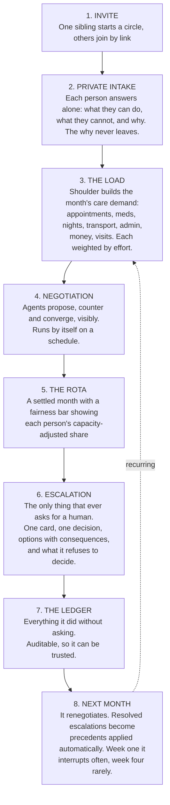
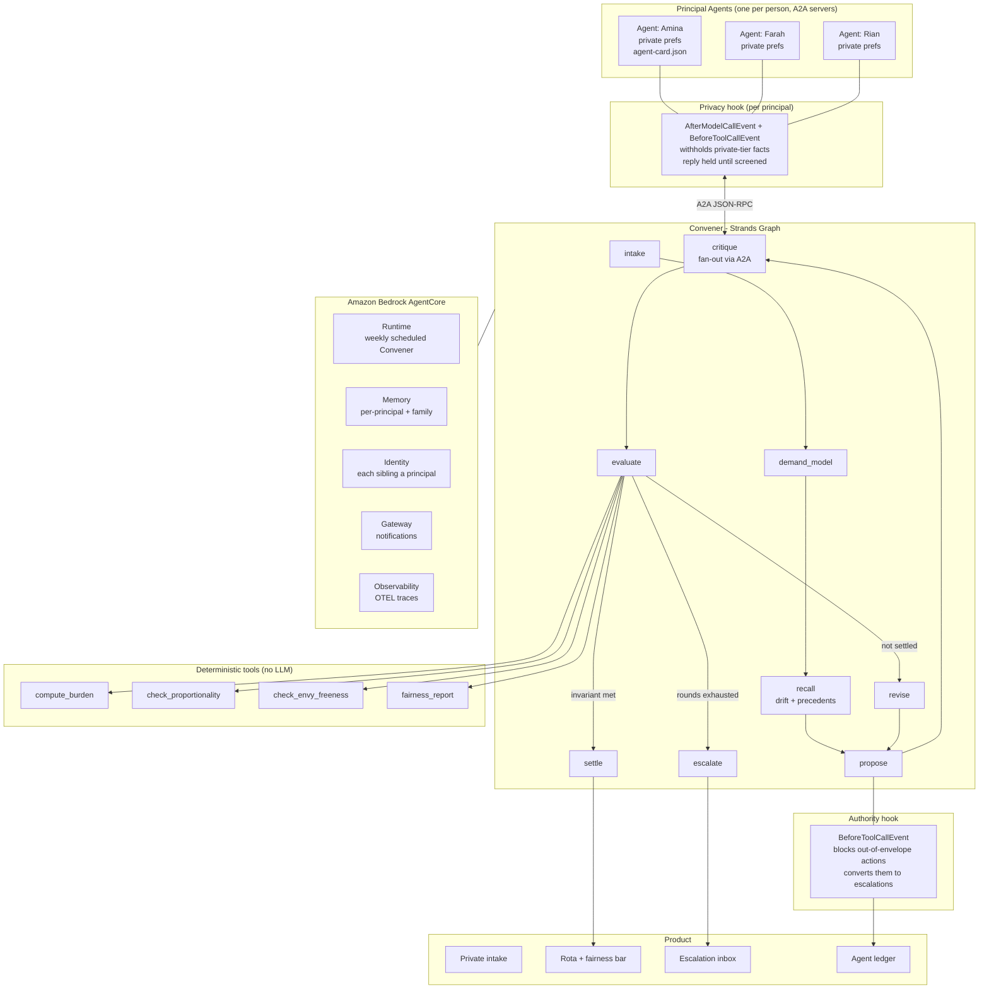

# CLAUDE.md - Shoulder

> **Persistent project memory.** Read this file top-to-bottom before doing anything else in a new
> session. It is the single source of truth for what this project is, why it exists, what is
> already decided, and what is left to do. Update it at the end of every working session.

---

## 0. How to resume a session

**Team of two - Shawki and Ashfaq - working sequentially, never simultaneously.
Read `TaskDivision.md` to find out whose block is active and what the last handoff owed you.**

1. Read this whole file, then `TaskDivision.md`.
2. Read `## 15. Session log` (bottom) for where we actually stopped.
3. Read `## 12. Implementation checklist` and find the first unchecked box.
4. Do **not** re-litigate decisions in `## 13. Decisions already made`. They cost hours of research.
5. Check `## 14. Risk register` before making scope calls.
6. Before finishing a session, update the checklist and append to the session log.

---

## 1. Hard rules - Claude must follow these

**Product invariants (violating these breaks the thesis, not just the code):**

- **The agent never makes the human decision.** It proposes, it does the safe work, and it escalates.
  Any feature that has the agent deciding something consequential is wrong by construction.
- **Fairness math never goes through an LLM.** All burden / proportionality / envy calculations live
  in deterministic `@tool` functions. The LLM negotiates and explains; it does not compute fairness.
- **Private-tier facts never leave a Principal Agent.** Principals emit *positions*
  ("cannot take weekends, capacity 0.6"), never *reasons* ("I'm in chemo"). Enforced by a hook,
  not by prompt wording.
- **Every feature must be demonstrable in the 3:30 video.** If it cannot be shown, it does not get
  built before the deadline. See `## 8. The demo`.

**Engineering rules:**

- Python **3.11** via the project venv (`py -3.11`). Never the system Python 3.14 (wheel breakage risk).
- Never claim something works without running it and showing the output. Evidence before assertions.
- No secrets in the repo. AWS credentials come from the environment / `~/.aws`.
- The repo must stay publicly runnable from a clean clone with seeded demo data. Use
  `python -m shoulder.cli`. **`make` is not installed on Shawki's machine**, so the Makefile is a
  convenience only and must never be the documented path.
- MIT license file at repo root, detectable by GitHub's About panel. This is a submission requirement.

**Git and authorship rules:**

- **Never commit or push with Claude, or any AI assistant, named as author, co-author or
  contributor.** No `Co-Authored-By` trailer, no generated-with footer, no session links.
  Every commit is authored by **ahammadshawki8** or **ashfaq**, and nothing else.
- **Use exactly this identity for Shawki's commits. Do not substitute any other address**,
  including any email that appears in session context:

  ```
  user.name  = ahammadshawki8
  user.email = ahammadshawki8@users.noreply.github.com
  ```

  Never pass `-c user.email=...` with anything else. If the local repo config is missing or
  wrong, set it to the two values above rather than guessing from the environment. This was
  got wrong once already and required rewriting history to correct.
- **Ashfaq's commits use exactly this identity** (his GitHub account is `ashfaqstu`, id
  187305680). Same rule: never substitute an address from session context.

  ```
  user.name  = ashfaqstu
  user.email = 187305680+ashfaqstu@users.noreply.github.com
  ```

- **Ashfaq works from a fork**, `https://github.com/ashfaqstu/Shoulder` (remote `origin`), with
  Shawki's repo as `upstream`. He has read-only access to `upstream` until Shawki adds
  `ashfaqstu` as a collaborator; until then his milestones reach `upstream` as pull requests.
- **Commit and push to GitHub after every completed milestone**, not just at the end of a tier.
  The remote must always hold a working, up-to-date version so either teammate can pick it up.
- Commit messages state what changed, in plain language. Handoff commits use the format in
  `TaskDivision.md` section 4.

**Documentation rules:**

- **Do not create new summary, status, or report markdown files.** No `SUMMARY.md`,
  `PROGRESS.md`, `NOTES.md`, `IMPLEMENTATION.md` or similar. Update `CLAUDE.md` instead. The only
  markdown files that should exist are `CLAUDE.md`, `TaskDivision.md`, `README.md`, and the
  license. Add another only if it is genuinely required for the submission.
- **No emojis, and no long em dashes, anywhere.** Not in code, comments, commit messages,
  documentation, UI copy, the README, blog posts, or the video script. Use commas, colons,
  parentheses, or a rewritten sentence.
- **Every diagram is a mermaid code block.** Architecture, flows, sequences, state. No ASCII art,
  no external drawing tools, no image-only diagrams. Mermaid renders on GitHub and stays editable
  and diffable. Export to an image only when the submission specifically demands an image file.

**Deadline rules:**

- Hard deadline: **Sun 14 Sep 2026, 5:00pm PT** (= Mon 15 Sep, 6:00am GMT+6).
- A complete Devpost draft must be submitted by **Sat 13 Sep**. Never leave submission to the last day.
- Scope gets cut before quality does. If we are behind, cut Tier 5 and Tier 7 - never Tier 4 or Tier 6.

---

## 2. Project identity

| | |
|---|---|
| **Name** | **Shoulder** |
| **Tagline** | *Nobody should shoulder it alone.* |
| **One-liner** | Private agents that negotiate the family caregiving load, so one sibling stops carrying all of it. |
| **Hackathon** | AWS "Agents for Humans" - agentsforhumans.devpost.com |
| **Track** | **OPEN - Claude recommends Everyday Agents** (the brief lists "family" explicitly there). Good Neighbor has better prize odds but a theme-fit stretch. **Confirm with the user before submitting.** |
| **License** | MIT |
| **Deadline** | Sun 14 Sep 2026, 5:00pm PT |

*Alternate names considered, if we ever want to swap: Evenly, Carve, Parity, Kin, Fair Share.*

**Fill these in as they exist - a future session will need them:**

| Field | Value |
|---|---|
| Repo URL | https://github.com/ahammadshawki8/Shoulder |
| Devpost submission URL | _TBD_ |
| AWS Builder ID | _TBD_ |
| Live demo link | _TBD_ |
| Video URL (YouTube, public) | _TBD_ |
| Blog post 1 URL | _TBD_ |
| Blog post 2 URL | _TBD_ |
| Blog post 3 URL | _TBD_ |

---

## 3. The problem

When a parent starts needing care, the work does not get divided. It lands on one person.

**In 75% of families, exactly one adult child becomes the caregiver.** Not by agreement - by default.
Usually whoever lives closest, and usually a daughter. The conversation that would redistribute the
load is the hardest conversation a family ever has, so it never happens. Resentment compounds
silently for years.

Existing caregiving apps are shared to-do lists. The best of them (CircleCare) advertises
"contribution visibility" - it *shows you* the inequity. **None of them redistributes it**, because
redistribution requires negotiating between people, and no app can negotiate.

**Who it is for:** adult siblings - typically 2 to 5 - sharing responsibility for an ageing parent.
Secondary: any care circle (partners, extended family, close friends) carrying a recurring load.

**Why it matters:** this is one of the largest pools of unpaid labour on earth, it falls
disproportionately on women, and the failure mode is not logistical - it is that nobody can have
the conversation.

---

## 4. Research backing

Every number below is citable in the README, the video, and the blog posts.

**Scale of the problem**
- **59 million** US caregivers provided **49.5 billion hours** of care in 2024 - AARP, *Valuing the Invaluable* (2026 update)
- Economic value **$1.01 trillion**, exceeding total federal + state + local Medicaid spending ($932B)
- Average **27 hours/week** per caregiver; equivalent to 17% of all US full-time workers
- **65% of unpaid care work is done by women** (~296 hrs/yr each, ~$643B) - National Partnership for Women & Families

**The core statistic (verified to primary source)**
- **"In 75 percent of all cases, only one adult child will become a caregiver."**
  Raab, Engelhardt & Leopold, *Journal of Marriage and Family*, March 2014.
  US Health and Retirement Study; 2,452 parent–child relationships across 641 families, 1998–2008.

**This is not a US problem - region-agnostic evidence**
- The 75% finding uses US data, but unequal sibling division and caregiver burden are documented
  cross-culturally: *Measuring the Economic Burden of Family Caregiving in a Rapidly Aging East
  Asian Population* (PMC12759494), and *Societal perceptions of caregivers linked to culture across
  20 countries: evidence from a 10-billion-word database* (PMC8248619).
- Population ageing is global. Every country with ageing parents and multiple adult children has
  this problem.
- **Shoulder hardcodes no jurisdiction, no benefit scheme, and no legal regime** - only tasks,
  capacities, and fairness. This is why it is region-agnostic by construction, and we should say so.

**That the conversation itself is the barrier**
- **NegotiAge** - an AI-based *caregiver negotiation training* program, MOST trial, published in the
  *Journal of the American Geriatrics Society* (2024). Trains humans to negotiate with their siblings
  using AI avatars that deploy "emotional tactics and irrational behaviors."
  → **Our framing:** there is a clinical trial of a program that teaches people how to talk to their
  own brother about mum. That is how hard this is. We are not building the training - we are
  building the negotiation.

**Fair division theory (the spine of our fairness tools)**
- *New Algorithms for the Fair and Efficient Allocation of Indivisible Chores* - IJCAI 2023
- *Distribution of Chores with Information Asymmetry* - arXiv 2305.02986 (our exact setting: private preferences)
- *Repeated Fair Allocation of Indivisible Items* - AAAI 2024 (our exact setting: weekly recurrence)
- Fairness notions used: **proportionality** and **envy-freeness**, capacity-adjusted

**Evaluation grounding**
- **MAGPIE** - *A Benchmark for Multi-Agent Contextual Privacy Evaluation*, arXiv 2510.15186.
  Agents hold preferences, some shareable and some private; conflicting preferences make negotiation
  necessary. Frames our privacy eval.

---

## 5. What makes this win (rubric mapping)

Five equally weighted criteria, plus up to **+0.6** bonus. Top submissions cluster at 4.2–4.7,
so the bonus is likely decisive.

| Criterion | Our claim |
|---|---|
| **Technical Implementation** | A2A protocol with genuine `context_id` privacy isolation; Graph orchestration; deterministic fair-division tools; two enforcement hooks; AgentCore Runtime + Memory + Identity + Gateway; eval suite |
| **Design** | Four coherent screens: private intake, rota, escalation inbox, agent ledger. A complete product, not a demo script. |
| **Potential Impact** | $1T of unpaid labour, 59M people, the 75% statistic, and a gender-inequity story |
| **Creativity & Originality** | N-way, longitudinal, fairness-governed agent negotiation over *private* preferences. Not monitor-and-filter - which is what most of the field will ship. |
| **Presentation** | A demo judges have not seen, opening on the NegotiAge line |
| **Bonus (+0.6)** | **3 builder.aws.com posts, "Agents for Humans" in each title.** Non-negotiable - see Tier 9. |

**Competitive context:** 8,497 registrants; the comparable AWS hackathon converted 9,500 registrants
into 625 submissions (~6.6%). Expect ~600 submissions, ~200 in Everyday. The realistic field of
finished, deployed, well-presented builds is 40–60. Most will be monitor→filter→escalate agents.

---

## 6. Features and the linear flow

The product is deliberately **one straight line**. No dashboards to explore, no settings to tune.



**Core features**
- Private preference intake with explicit **shareable / private** tiers
- Autonomous N-way negotiation between agents over the A2A protocol
- Capacity-adjusted fairness invariant, computed deterministically
- Escalation cards - structured, with options, consequences, and an explicit refusal
- Precedent learning from how humans resolved past escalations
- Agent ledger (full audit trail of unattended actions)
- Weekly background re-negotiation on a schedule - nobody opens an app

---

## 7. UI/UX principles

The product's whole promise is *less* attention, so the interface must feel calm.

- **One decision per screen.** Never present two escalations at once; queue them.
- **The escalation inbox is the product.** If it is empty, the app should say so warmly and show
  nothing else. An empty inbox is success, not an empty state to fill.
- **Show the reasoning, hide the machinery.** Users see "Amina is carrying 40% more hours," never a
  JSON blob, a token count, or an agent name.
- **Privacy must be visible, not promised.** The intake screen visibly marks what will be shared and
  what will never leave. This is the trust moment; spend design effort here.
- **The fairness bar is the hero component.** One horizontal bar per person, capacity-adjusted,
  animating as negotiation rounds land. It carries the demo.
- **Warm, not clinical.** This is a family in a hard moment, not a logistics console. Generous
  whitespace, real typography, restrained colour, no dashboard chrome.
- **Never blame a family member in copy.** "Amina is carrying more" - never "your siblings are not
  helping."
- Accessible by default: keyboard navigable, sufficient contrast, works in light and dark.

---

## 8. The demo - this drives what we build

Target **3:30**, hard cap 5:00. Must cover: the problem, who it is for, why it matters.
Build order should follow this storyboard - if a feature does not appear here, it is not urgent.

| Time | Beat | What is on screen |
|---|---|---|
| 0:00–0:25 | **The problem** | "In 75% of families, when a parent needs care, exactly one adult child ends up doing all of it." Then the scale: 59M caregivers, 49.5B hours, **$1.01 trillion - more than all Medicaid spending combined**. 65% of it done by women. |
| 0:25–0:45 | **Why it persists** | The NegotiAge line: *"There is a clinical trial of a program that teaches people how to talk to their own brother about mum. That is how hard this conversation is. We didn't build the training. We built the negotiation."* |
| 0:45–1:20 | **Private intake** | Three siblings, three private screens. Amina - nearby, carrying everything. Rian - distant, has money not time. Farah types something she has never told her family (a health constraint), and the UI visibly marks it **never leaves this device**. |
| 1:20–2:10 | **The negotiation** | The Convener wakes on schedule - nobody opened an app. Agents propose and counter over A2A. Fairness bars move each round. It settles on a rota satisfying capacity-adjusted proportionality - **having quietly routed around Farah's constraint without anyone learning why**. |
| 2:10–2:45 | **The escalation** | One card. *"I couldn't close this fairly. Amina is carrying 40% more than either of you. She hasn't complained. I thought you should know. This isn't mine to decide."* Two options with their fairness consequences. A human taps one. |
| 2:45–3:05 | **It learns** | Next month. *"Last time you decided whoever hosts doesn't also drive. I applied that without asking."* Escalation count drops 4 → 1. |
| 3:05–3:30 | **How it is built** | Architecture diagram; the A2A privacy boundary; the hook **caught live** blocking a deliberate leak attempt; AgentCore Runtime / Memory / Identity. Close on the tagline. |

**Demo rules**
- No terminal-only footage. Every beat must have a product surface.
- Every claim on screen must be backed by something actually in the repo.
- The privacy-hook block is **shown live**, never merely described. It is the single most persuasive
  five seconds in the video.
- Say "the agent never decides" out loud, on camera. It defuses the biggest framing risk.

---

## 9. Architecture



**Why each Strands feature is here (not decoration):**

| Feature | Why it is genuinely needed |
|---|---|
| **A2A protocol** | Principals must hold state the Convener cannot read. `context_id` isolation makes the privacy boundary real rather than promised. |
| **Graph** | Negotiation is bounded rounds with conditional exits. (Swarm is unsupported with A2A as of 1.55.) |
| **Custom `@tool`s** | Fairness must be verifiable and identical every run. LLMs must not compute it. |
| **Hooks** | Privacy and authority are enforced in code. A prompt instruction is not an enforcement mechanism. |
| **Sessions / Memory** | The rota recurs weekly and preferences drift; precedents must survive restarts. This is what makes it a background agent rather than a script. |
| **Structured output** | Escalation cards are a typed contract between agent and UI. |

---

## 10. Data

**No real family data is used.** Seeded synthetic circles, clearly labelled.

**Entities**
- `Circle` - the family unit; members, the care recipient, the period
- `Principal` - one person; `capacity` (0–1), shareable constraints, private constraints, agent endpoint
- `CareTask` - recurring or one-off; type, date/window, duration, effort weight, location, skill requirement
- `Position` - what a principal's agent emits: availability windows, hard vetoes, capacity, soft
  preferences. **Never carries private reasons.**
- `Allocation` - a mapping of tasks to principals for a period
- `FairnessReport` - per-principal burden, capacity-adjusted share, proportionality result, envy pairs
- `EscalationCard` - `{id, kind, what_i_tried[], the_tension, options[{label, consequence, fairness_delta}], what_i_will_not_decide, deadline}`
- `Precedent` - a resolved escalation turned into a rule, with provenance ("you decided this on 12 Aug")
- `LedgerEntry` - every unattended action, with timestamp and justification

**Privacy tiers:** every constraint carries `tier: "shareable" | "private"`. The privacy hook filters
on this field. The privacy eval asserts no `private` content ever appears in an outbound A2A payload.

**Demo seed:** three siblings - Amina (nearby, carrying most of it), Rian (distant, money but no
time), Farah (a hidden health constraint she will not disclose to the family). The hidden constraint
is what makes the demo land: the agent negotiates around it without ever revealing it.

---

## 11. Stack

| | |
|---|---|
| Language | Python **3.11** (project venv via `py -3.11`, never system 3.14) |
| Agent SDK | `strands-agents` 1.55.x |
| Models | Bedrock `us.anthropic.claude-sonnet-4-5-20250929-v1:0` (reasoning), `us.anthropic.claude-haiku-4-5-20251001-v1:0` (fast). Sonnet 5 is in the catalogue but returns AccessDenied until model access is enabled in the Bedrock console. |
| Region | `us-east-1` (account 897545289507, verified working) |
| A2A servers | FastAPI |
| UI | Vite + React |
| Local state | SQLite |
| Deploy | AgentCore Runtime + Memory + Identity + Gateway; OTEL → CloudWatch |

---

## 12. Implementation checklist

### Tier 0 - Foundation
- [x] `git init`, MIT `LICENSE` at root (must show in GitHub About panel)
- [ ] Python 3.12 venv, `pyproject.toml` / `requirements.txt`
- [x] `strands-agents` installed; Bedrock connectivity smoke test passing
- [x] Repo skeleton: `agents/`, `tools/`, `hooks/`, `graph/`, `web/`, `evals/`, `seed/`, `docs/`
- [x] `.gitignore` (venv, `.env`, `__pycache__`, SQLite)

### Tier 1 - Core agents
- [x] `Principal` data model with privacy tiers
- [x] Principal Agent + `A2AServer`, agent card served
- [x] Convener reaches all three principals over A2A (see note: the client is `A2AClientToolProvider` from strands-agents-tools, not `A2AAgent`)
- [x] One propose → critique → response round works end-to-end (ugly is fine)

### Tier 2 - Fairness engine
- [x] `CareTask` model + effort weighting
- [x] `compute_burden`
- [x] `check_proportionality` (capacity-adjusted)
- [x] `check_envy_freeness`
- [x] `fairness_report` (structured output)
- [x] Unit tests for all four; fairness is never LLM-computed

### Tier 3 - Negotiation graph
- [x] Full Strands Graph: intake → demand_model → propose → critique → evaluate → revise/settle/escalate
- [x] Bounded rounds with exhaustion → escalate
- [x] `EscalationCard` structured output
- [x] Settled rota persisted

### Tier 4 - Guardrails (do not cut this tier)
- [x] Privacy hook: blocks private-tier facts on outbound A2A messages
- [x] Authority-envelope hook: out-of-envelope action → escalation card
- [x] Ledger: every unattended action recorded with justification
- [x] Demo proof: privacy hook visibly catching a deliberate leak attempt (`python -m shoulder.demos.leak`)

### Tier 5 - Memory and precedent
- [x] Per-principal session persistence (preferences drift over time)
- [x] Family session: rota history + resolved escalations
- [x] Precedent extraction from resolved escalations
- [x] Precedent application in the next period, with provenance shown (`python -m shoulder.demos.next_month`)

### Tier 6 - Product surface
- [x] Private intake screen (privacy tiers visible - the trust moment)
- [x] Rota + fairness bar (hero component, animates across rounds)
- [x] Escalation inbox (one decision per screen; warm empty state)
- [x] Agent ledger
- [x] Light/dark, keyboard accessible, responsive

### Tier 7 - Evals
- [ ] Fairness: invariant holds across N generated circles
- [ ] **Privacy: no private-tier fact ever appears in an outbound A2A payload** (adversarial, MAGPIE-framed)
- [ ] Escalation boundary: precision/recall on labelled should / should-not scenarios
- [ ] Precedent regression: escalation count falls month over month

### Tier 8 - Deployment
- [ ] Convener on AgentCore Runtime, weekly schedule
- [ ] AgentCore Memory wired
- [ ] AgentCore Identity: each sibling a distinct authenticated principal
- [ ] AgentCore Gateway for notifications
- [ ] OTEL traces to CloudWatch
- [ ] **Live demo link** (explicitly raises Technical Implementation score)

### Tier 9 - Submission
- [ ] README with problem, architecture, setup, research citations
- [x] Architecture diagram exported as an image (`docs/architecture.svg` and `.png`, ELK layout)
- [ ] `make demo` runs from a clean clone with seeded data
- [ ] Public repo, MIT license visible in About
- [ ] AWS Builder ID obtained
- [ ] Video ≤ 5 min (target 3:30) on YouTube, public - see `## 8. The demo`
- [ ] **Blog post 1:** "Agents for Humans: Teaching an Agent to Keep a Secret" (A2A privacy boundary)
- [ ] **Blog post 2:** "Agents for Humans: Fair Division as a Deterministic Tool"
- [ ] **Blog post 3:** "Agents for Humans: Building an Agent That Refuses to Decide"
- [ ] Devpost draft submitted **by Sat 13 Sep**
- [ ] Track confirmed with the user (see `## 2`)
- [ ] Final submission with hours to spare

### Admin (user actions - Claude cannot do these)
- [ ] Request $50 AWS credits - **deadline Fri 11 Sep, 12:00pm PT** (https://forms.gle/6sjzKiX6bKUMA5NEA)
- [ ] Register / join the hackathon on Devpost
- [ ] Obtain AWS Builder ID

---

## 13. Decisions already made - do not re-litigate

**Ideas researched and rejected** (each died on saturation; re-checking them wastes hours):

| Idea | Why it died |
|---|---|
| Blood donor mobilisation agent | Devpost is full of them; Bangladesh's BADHAN app already has 64k donors with automatic eligibility-date calculation |
| Referral loop closure | "Closed-loop referral management" is an established commercial SaaS category |
| Peer-review reviewer sourcing | TPMS / OpenReview affinity scoring already exist; Impact caps too low |
| Benefits-churn agent | Excellent research, but US-specific - rejected on region-agnosticism |
| Test-result loop closure | "Critical Test Results Management" is a named category; a 2026 PubMed paper published nearly our exact project |
| Open-source issue triage | GitHub shipped native duplicate detection Jun 2026; FixClaw does our exact flow |
| Household mail / document agent | Six shipping products (LetterMagic, Papeer, Clerkly, Orlo, Life Inbox, AutoPA) |
| Neighbourhood civic watchdog | CivicLens on Devpost has our exact architecture (profiles, interests, alerts, scrapers, background jobs) |

**Key strategic lessons learned:**

1. **Monitor → filter → escalate is the obvious agent shape.** Thousands of entrants will ship it.
   Our edge is topology: N-way negotiation between agents holding *private* preferences.
2. The rubric scores *"a non-obvious use of Strands Agents"* - **originality of the agent design**,
   not market novelty. Nothing in agent-land is virgin in 2026.
3. 60% of the rubric is not engineering (Design, Impact, Presentation). Budget time accordingly.
4. Judges are not required to test the code - the video and README carry disproportionate weight.

**Fixed decisions:** name Shoulder · Graph not Swarm (A2A limitation) · capacity-adjusted
proportionality as the fairness invariant · MIT license. Track is still open (see `## 2`).

---

## 14. Risk register

| Risk | Severity | Mitigation |
|---|---|---|
| **Adjacency to the brief's named "family calendar" example** - that example is radioactive, hundreds will build it | High | First sentence of the video and README: *"This is not a calendar. It is a negotiation about who does the work."* |
| **Demo reads as theatre** - if the allocation looks trivially computable, the agents look decorative | High | Seed genuinely conflicting hard constraints; show at least one real deadlock and one counter-proposal that changes the outcome; always show the fairness numbers moving |
| **"An AI decides who cares for mum" framing** could read badly to judges | Medium | The agent never decides - every consequential call becomes an escalation. State this explicitly on camera. |
| **AgentMesh collision** (GitHub project doing bilateral agent negotiation incl. chore schedules) | Medium | State our four differentiators in README and video: **N-way**, **longitudinal**, **fairness-invariant-governed**, **domain-specific** |
| **A2A + Graph integration friction** eats the schedule | Medium | Tier 1 proves one round end-to-end on day one. Fallback: direct agent-to-agent calls with the same privacy hook, disclosed honestly in the README. |
| **Synthetic family data undercuts credibility** | Low | Label it clearly. The product is the reasoning; preferences are the input by design, so synthetic input is not a weakness here. |
| **Running out of time** | High | Devpost draft submitted Sat 13. Cut Tier 5 and Tier 7 before Tier 4 or Tier 6. |
| **Blog bonus missed** (worth up to +0.6, likely decisive) | High | Draft posts alongside the tiers they describe, not at the end. Posts 1 and 3 are writable as soon as Tier 4 lands. |

---

## 15. Session log

### 2026-09-09 - Session 1
- Researched the hackathon, rubric, competitive field, and Strands / AgentCore capabilities.
- Audited and rejected eight candidate ideas (see `## 13`).
- **Locked: Shoulder.** Design presented in outline and approved.
- Verified: AWS account live in us-east-1 with full Bedrock catalogue; Strands A2A support is
  production-ready (`A2AServer` / `A2AAgent`, `context_id` isolation, agent cards).
- Verified the 75% statistic to primary source (Raab / Engelhardt / Leopold, JMF 2014).
- Wrote this file. Added demo storyboard, region-agnostic evidence, risk register, placeholder
  fields, and reopened the track decision.

### 2026-09-09 - Session 2, Tiers 0 to 3 complete (Shawki)

Repo live at https://github.com/ahammadshawki8/Shoulder, public, MIT visible in About.
`pytest` is green at 20 passed. `python -m shoulder.cli` runs a full negotiation end to end and
writes `fixtures/`.

**Environment facts a future session needs:**
- Python 3.12 is not installed on this machine. Using **3.11.9** via `py -3.11`. Strands is fine on it.
- `anthropic.claude-sonnet-5` is listed in the Bedrock catalogue but returns **AccessDenied**.
  Pinned to Sonnet 4.5 and Haiku 4.5, both verified working. Enable Sonnet 5 model access in the
  Bedrock console if it is wanted later; nothing depends on it.
- AWS CLI was already installed (2.36.33). `gh` is authenticated as ahammadshawki8.

**A2A is wired and working.** Each sibling runs in their own process, on their own port, serving
their own agent card. Verified end to end with `python -m shoulder.a2a.demo`: three servers start,
twelve JSON critiques cross the wire, the run exits 0, and no private constraint appears in any
captured payload.

Important correction to what the docs suggest: **`A2AAgent` does not exist in strands-agents
1.55.0.** `strands.multiagent.a2a` ships the server side only (`A2AServer`, `StrandsA2AExecutor`,
`AgentFactory`). The client is `A2AClientToolProvider` from **strands-agents-tools**
(`strands_tools.a2a_client`), and `a2a_send_message` is a **coroutine**, so it must be awaited on a
worker thread because the graph node calling it already sits inside a running event loop. Getting
this wrong silently logs `<coroutine object ...>` as the reply rather than raising.

Structured output does not cross A2A, so principal agents get a `wire_format=True` system prompt
that makes them answer in strict JSON, and `shoulder/a2a/client.py` parses it back into a `Critique`.
Both transports build the same prompt via `build_critique_prompt`, so the A2A run tests what the
local run does.

`shoulder/a2a/client.py` captures every message that crossed the wire into
`fixtures/a2a_wire_log.json`. **That file is what Tier 7's adversarial privacy eval should assert
against**, and it is the real outbound surface for Ashfaq's Tier 4 privacy hook.

**Other design decisions, with reasons:**
- **The Convener proposes moves, not whole allocations.** Re-emitting all 26 assignments each round
  made the split worse every time (deviation ran 0.229, 0.837, 0.999). Limiting it to at most four
  named moves fixed the drift.
- **Eligibility is precomputed for the Convener.** It kept proposing Friday work for a sibling who
  had said she was unavailable on Fridays. It now receives the list of legal moves and chooses among
  them. Eligibility is a rule, not a judgement.
- **A deterministic legality guard runs after every proposal** (`repair_allocation`). Illegal
  assignments are stripped and re-placed. A rota that breaks a stated limit must never reach a family.
- **Hill climbing.** A round may explore a worse split; the working rota never keeps it.
- **Retries on structured output.** Bedrock intermittently returns "No valid tool use found". Every
  structured call goes through `shoulder/resilience.py` with a safe fallback. A missing critique is
  recorded as silence, never as consent.
- **All model prose passes through `shoulder/text.py`** to strip emojis and em dashes, per the
  project rule. Models produce both unprompted.

**State of the demo scenario:** feasible but deliberately not fair. All 26 tasks assigned, no hard
violations, deviation 0.229 against a 0.15 tolerance. That gap is the point: the agent does
everything it can and the remainder is a human decision. `tests/test_fairness.py` asserts this exact
shape so a future change cannot silently destroy the demo.

**Commands that work today:**

```
python -m shoulder.cli --dry     deterministic fairness engine, no model calls, no network
python -m shoulder.cli           full negotiation in process
python -m shoulder.a2a.demo      full negotiation across three A2A servers, writes the wire log
python -m pytest                 20 tests, no AWS needed
```

**Git identity was rewritten once.** Two commits were made with the wrong author email
(`srot.dev@gmail.com`, picked up from session context). All four commits were rewritten to
`ahammadshawki8 <ahammadshawki8@users.noreply.github.com>` and force pushed. Do not repeat this:
the identity is pinned in section 1.

- **Next:** Tier 4 (privacy hook, authority envelope hook, ledger) is Ashfaq's block per
  `TaskDivision.md`. Fixtures are committed so the UI can be built with no AWS access at all, and
  the A2A wire log gives the privacy hook a real surface to guard.

### 2026-09-11 - Session 3, Tier 4 complete (Ashfaq)

**Block 1 handoff verified before building on it.** `pytest` 20 passed, `cli --dry`, `cli` and
`a2a.demo` all ran clean against Bedrock with Ashfaq's IAM user (`user/ashfaq`, profile
`shoulder`). Environment: this machine has **Python 3.12.7** only (no 3.11); everything works on it.

**What Tier 4 added** (64 tests now, all offline):

```
python -m shoulder.demos.leak            privacy hook catching a leak over real A2A, no AWS
python -m shoulder.demos.leak --live     same, real Sonnet with its privacy instruction removed
python -m shoulder.demos.envelope        authority envelope: one action allowed, two refused
```

- `shoulder/hooks/privacy.py`: `PrivacyGuard`, a Strands `HookProvider` on every principal agent
  (`AfterModelCallEvent` rewrites the finished message, `BeforeToolCallEvent` screens tool input,
  which is how the in-process `Critique` travels). Detection is deterministic: the private reason
  and its clauses, per-constraint `sensitive_terms`, and three-word runs of the reason, each checked
  on normalised text and on punctuation-free text. `scan_for_leaks` is the same detector for audits.
- `shoulder/hooks/authority.py`: `AuthorityGuard` on `BeforeToolCallEvent` for the Convener.
  `decide()` is the envelope as a pure function. Measuring is free; `send_reminder` is inside only
  for tasks the person already holds; `arrange_paid_help`, `drop_task`, `change_capacity` are
  outside; **anything unnamed is outside** (fails closed). A refused call never runs, returns "not
  done, raised with the family" to the model, and becomes an `authority_exceeded` card whose
  numbers come from the fairness engine (`_without`, capacity what-ifs), with fixed copy.
- `shoulder/tools/actions.py`: the acting tools. The always-refused ones are offered on purpose: the
  envelope is a policy about authority, not about which tools exist.
- `shoulder/ledger.py` + `shoulder/store/sqlite.py`: append-only ledger. `family` scope is the
  shared audit trail; `private:<id>` entries (what a guard held back, including the draft) go to
  their own SQLite file under `.shoulder/private/`. The graph records every unattended step: seed,
  suggested moves (in words), reversed illegal moves, rejected worse splits, each critique, each
  fairness measurement, remedies, escalations.
- Graph: the escalate node now gives the Convener **one chance to act** (`attempt_remedies`, through
  the agent loop so tools run) before writing the fairness card. Anything refused becomes its own
  card, queued after the fairness card.
- `shoulder/scripted_model.py`: a Strands `Model` that plays back a script, so hooks are tested
  through the real agent loop, tool executor and A2A server with no network.
- New fixtures: `ledger.json` (family view), `privacy_demo.json` (a real `--live` catch),
  `authority_demo.json` (scripted, deterministic). Regenerated: `circle.json`, `outcome.json`,
  `escalations.json`, `a2a_wire_log.json`. Every family-visible fixture passes `scan_for_leaks`.

**Findings that shaped it (each is pinned by a test):**
1. **The stock A2A executor streams text chunks to the caller before any hook sees the finished
   message.** The Block 1 wire log shows every reply twice, once whole and once as fragments. A
   post-model hook alone would screen text that had already left. `HeldReplyExecutor` in
   `shoulder/a2a/serve.py` holds the reply until it is screened. A control test serves the same
   guarded agent through the stock executor and asserts it leaks; if that test ever fails, the SDK
   changed, re-check before removing the hold.
2. **The old leak check could be beaten by chunking**: plain substring search misses
   `Chemo\ntherapy`. The detector also checks punctuation-free text.
3. **The deprecated `agent.structured_output()` skips the hook registry entirely.** The in-process
   critique now calls `agent(prompt, structured_output_model=Critique)`, with history cleared each
   round so behaviour matches before. The Convener's revise and escalation calls still use the
   deprecated path (unchanged), which also means the Convener never actually ran its fairness tools
   there. Only `attempt_remedies` uses the loop.
4. **Sonnet refuses to leak, and its refusals leak the category**: "private medical information",
   "genuine and health-related". Category words are now in Farah's `sensitive_terms`. This is the
   best evidence we have that the hook, not the prompt, has to be the enforcement.
5. **Redacting only the offending sentence is not enough.** The sentence left behind read "she needs
   help quickly if she develops any complications". Any free text carrying a private fact is now
   withheld whole; structural fields (verdict, reason class, task ids) still pass.
6. **A private constraint's summary is its effect, not its secret.** Screening "Unavailable Friday
   and Saturday" flagged the Convener stating Farah's public Position, and made the family ledger
   fail its own audit. Only reasons and sensitive terms are screened; `Principal.private_texts()`
   now returns reasons only. Intake (Tier 6) must keep the why out of `summary`.
7. **In process, the model writes working notes that quote the private constraint.** They never
   leave (only the `Critique` does), so the guard scrubs them silently. Announcing them would have
   put "Farah's agent held something back" in the family ledger every round, itself a small leak.
   `PrivacyGuard(reply="text" | "structured")` makes the outbound surface explicit.

**Behaviour worth knowing for the demo:** in one live run the Convener used the fairness tools, found
the split is almost exactly fair if Farah's capacity were 0.5 instead of 0.7, and called
`change_capacity`. The envelope refused: *"I will not change what Farah said they can carry."* In
another run it checked, found nothing that helps, and took no action. Both are correct; it is not
forced to act. The deterministic version of that beat is `demos.envelope`.

**Fragile / honest limits:**
- The detector is lexical. A paraphrase with no shared words and no sensitive term ("she is not
  well at the moment") would pass. Whole-text withholding narrows it; Tier 7's adversarial eval
  should probe it, and `sensitive_terms` is where fixes go. An LLM second opinion would be additive,
  never a replacement.
- In the A2A demo the family-scope "withheld" entries stay in each principal's process (servers run
  with no ledger), so the Convener's ledger does not show them. Fine for now; Tier 8 could forward
  content-free notices.
- `HeldReplyExecutor` overrides a private SDK method (`_handle_streaming_event`). Pinned by tests.
- `.shoulder/` holds local SQLite state and is gitignored. Delete it to reset.
- The rounds still all come back `accept` from every sibling and rounds 2 to 4 retry the same
  rejected moves (see the fairness bar note in the Block 1 verification: rounds show 0.229, 0.757,
  0.804, 0.757 as tried, 0.229 as kept). Not touched in Tier 4. The UI should show "tried" versus
  "kept" rather than animate straight through the tried splits.

**Git:** work is on the fork (`ashfaqstu/Shoulder`) because `ashfaqstu` has no push access to
`upstream` yet. Shawki: add `ashfaqstu` as a collaborator, or merge the PR.

- **Next:** Tier 5 (memory and precedent) and Tier 6 (four screens, fairness bar as hero), then the
  Block 2 handoff commit.

### 2026-09-11 - Session 3 continued, Tier 5 complete (Ashfaq)

**The loop, end to end** (93 tests, all offline):

```
python -m shoulder.cli                        October: negotiate, queue escalations
python -m shoulder.decide                     answer them, one card at a time (--precedents, --retire)
python -m shoulder.cli --period 2026-11       November: applies what was decided
python -m shoulder.demos.next_month [--live] [--write-fixtures]   both months back to back
```

- **Typed option effects** (`OptionEffect` on every `EscalationOption`): `accept_split`,
  `paid_help(task_ids)`, `remove_tasks(task_ids)`, `decline_action(action, principal_id)`, `none`.
  This is what makes a decision reusable. It also fixed a real invariant break: **the model was
  writing `fairness_delta` itself** (every value 0.0). `write_escalation` now sanitises the effects
  and sets every delta from `shoulder/tools/remedies.py`; the model is told to leave it at 0.
- **The escalation prompt now forbids options that ask a named person to give up a limit.** The
  previous live card offered "Ask Farah to expand availability to Friday or Saturday or to accept
  night shifts", i.e. pressure on the one person hiding chemotherapy. Only a person can revisit their
  own limits, privately. A "Keep the current split" option is added in code if the model omits it.
- **The engine finds remedies; the model judges them.** `best_paid_help` searches every one or two
  task set and hands the best to the Convener as a fact, in both the remedies and escalation
  prompts. For the demo family: paid help for the Wednesday overnight stay and the follow-up
  nephrology appointment takes 23 percent to 13 percent.
- `shoulder/precedent.py`: `extract()` builds a `Precedent` from the chosen option's effect, in code.
  Recurring tasks are matched by **title**, since ids restart each month. `provenance()` renders
  "Amina decided this on 11 Sep" in local time (stored UTC).
- **Where precedents apply:** a new deterministic `recall` graph node (entry point) takes covered
  tasks out of the family's split before anyone negotiates, each through the envelope's `decide()`;
  the **envelope widens or closes only by precedent** (paid help for those tasks becomes routine;
  a declined action is neither taken nor raised again, logged as `applied_precedent`); and
  `accept_split` publishes the best split **only after every round was tried**, with no veto and
  every limit intact.
- `shoulder/store/family.py`: SQLite rotas, escalations (open or resolved), resolutions,
  precedents. **One decision answers the same question everywhere**: choosing paid help on the
  fairness card also resolves the envelope's paid-help card for the same tasks. A card cannot be
  decided twice; a newer precedent with the same rule replaces the older; `retire` stops one.
- `shoulder/store/principal.py`: each person's profile saved per period in their own private file,
  and `drift()` split into public (Position changes, noted in the family ledger by recall) and
  private (constraint or reason changes, noted in their private ledger only).
- `shoulder/session.py`: `run_period()` is the loop the Tier 8 schedule should call.
- Seed: `build_tasks(period)` / `build_circle(period)` generate any month from the weekly pattern.
  October is byte-identical to before (checked against the committed fixture).
- `shoulder/demos/offline.py`: scripted models that run the real graph with no network. The
  Convener script acts on the engine's findings in its own prompt; the siblings accept.

**The numbers the "It learns" beat can honestly show** (offline and live agree on the shape):
October 23 percent, two decisions asked (the fairness card and the envelope's paid-help card).
The family chooses paid help once. November: recall arranges it, cites the decision, the re-seeded
split is 4 percent and settles in round one, **zero decisions asked**. The storyboard's "4 to 1" is
not what this family produces; use the real "2 to 0".

**Fixtures for Tier 6** (from the live run): October at `fixtures/` root, November at
`fixtures/2026-11/`, and `fixtures/family.json` with `history` (per month: escalations asked,
resolved, deviation, settled, precedents applied), every card with its status, every resolution,
and every precedent with its provenance line.

**Fragile / honest limits:**
- Matching recurring tasks by title means renaming a task silently ends a precedent. Fine for the
  seed; real intake should give recurring tasks a stable key.
- `accept_split` is an open-ended acceptance. It should expire or come back for review; not built.
- Drift is computed by the CLI session in process. In A2A mode each principal's profile would live
  in their own server; not wired.
- The live Convener's remedies step is still a model choice; it may or may not reach for paid help.
  The card's paid-help option comes from the engine finding either way.

### 2026-09-11 - Session 3 continued, Tier 6 complete, Block 2 handoff (Ashfaq -> Shawki)

**Run it:** `cd web && npm install && npm run dev`, open http://localhost:5173. No AWS needed; it
reads `fixtures/` (imported through a Vite alias, `server.fs.allow` covers the repo root). 95 Python
tests pass.

**Six screens, mapped to the storyboard in section 8** (switch October / November at the top):

| Beat | Screen | Notes |
|---|---|---|
| 0:00 to 0:45 problem, NegotiAge | Why | Every figure from section 4, sources listed |
| 0:45 to 1:20 private intake | Your agent | Per sibling. Left: answers, tier toggles, private reasons, the words the guard blocks. Right: what the family sees, recomputed live by a JS mirror of `to_position()`. Farah's "Replay the moment" types her reason while the family view does not move |
| 1:20 to 2:10 negotiation | This month | Round player with the fairness bar, the Convener's moves, each agent's answer, then the rota calendar. Paid help shows dashed in November |
| 2:10 to 2:45 escalation | Needs you | One card per screen, options priced by the engine, "what I will not decide", Decide. Recording a choice shows the standing rule it becomes and answers duplicate cards |
| 2:45 to 3:05 it learns | Needs you (November) | Warm empty state: "Nothing needs you this month", 2 to 0, and the decision cited with provenance |
| 3:05 to 3:30 how it is built | Under the hood | The live privacy catch (draft vs wire), the envelope's decisions, the wire log re-audited in the browser, and the architecture rendered from this file's section 9 mermaid |
| (ledger) | What I did | Every family-scope entry, by round, filterable, with justifications |

**The fairness bar needed a data change first.** Since the Block 1 hill climb, each round recorded
the split it *kept*, so October's four rounds were identical and the bar could not move.
`NegotiationRound` now carries `tried` (what the round proposed), `moves` and `kept`. The bar shows
solid bars for the working rota and a thin bar beneath for what the round tried, on one scale across
every round; a rejected round is marked with a red dot. Labels always give the signed figure ("12
percent above fair"), because "within range" beside a headline saying Amina carries 46 percent more
read as a contradiction.

**Escalation copy is now written for a family.** The first live card led with "70.48 adjusted share
... against a mean of 62.67". The headline is now the engine's own `report.headline()`, and the model
is told to use no numbers or engineering words; the engine's figures sit beside its prose. The same
review changed "worst deviation" to "spread" in the envelope cards and the ledger.

**Design:** Fraunces for headings, Source Sans 3 for text, bundled with `@fontsource` so the UI renders
offline. One identity colour per sibling on every screen (Amina blue, Rian orange, Farah aqua),
validated with the dataviz palette checks against both surfaces, all pairs, light and dark; the aqua
light step sits at 2.66:1, so every bar carries a visible name label and the chart has a table view.
Light and dark tokens, theme toggle (saved), `prefers-reduced-motion` honoured, focus rings, every
chart value reachable by keyboard with a tooltip. `#/month/2026-10/2` opens a round;
`?theme=dark` forces a theme (for recording).

**Fixtures** were regenerated by `python -m shoulder.demos.next_month --live --write-fixtures`
after the copy changes; every family-visible file passes `scan_for_leaks`.

**Fragile / honest limits:**
- Decisions in the inbox are held in memory (reload replays the month); the UI does not write
  back to `.shoulder/`. Tier 8's live link would need a small API over `FamilyStore`.
- The intake screen edits are local and illustrate the projection; they do not persist.
- Headless Chrome cannot go below about 500px wide, so the 400px check was done by reasoning plus a
  560px screenshot, not a true 400px render. Check on a real phone before recording.
- The mermaid bundle is large but lazy: it loads only when "Under the hood" opens.
- "Nobody opened an app" is shown as "negotiated by the agents"; the schedule itself is Tier 8.

**Handoff to Shawki (Block 3):** verify with `pytest`, `python -m shoulder.demos.leak`, and
`cd web && npm run dev`. The work is on `ashfaqstu/Shoulder` `main`; add `ashfaqstu` as a
collaborator or merge the pull request. Next: Tier 8 (AgentCore, the schedule, a live link that can
serve `web/` and a thin API over `FamilyStore`), README polish, Devpost draft by Sat 13 Sep.
