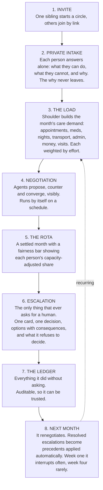
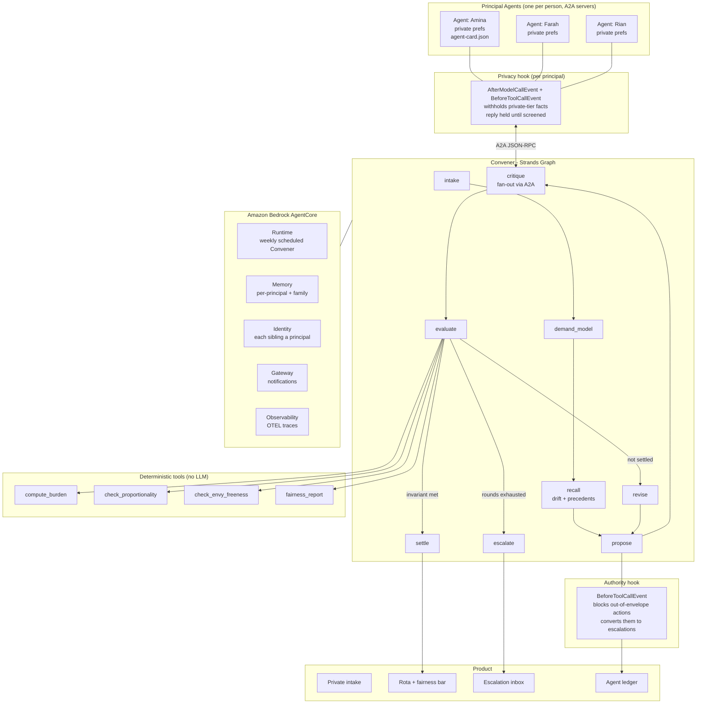

# CLAUDE.md - Shoulder

> **Persistent project memory.** Read this file top-to-bottom before doing anything else in a new
> session. It is the single source of truth for what this project is, why it exists, what is
> already decided, and what is left to do. Update it at the end of every working session.

---

## 0. How to resume a session

**Team of two - Shawki and Ashfaq - working sequentially, never simultaneously.
Read `TaskDivision.md` to find out whose block is active and what the last handoff owed you.**

1. Read this whole file, then `TaskDivision.md`.
2. Read `## 15. Session log` (bottom) for where we actually stopped.
3. Read `## 12. Implementation checklist` and find the first unchecked box.
4. Do **not** re-litigate decisions in `## 13. Decisions already made`. They cost hours of research.
5. Check `## 14. Risk register` before making scope calls.
6. Before finishing a session, update the checklist and append to the session log.

---

## 1. Hard rules - Claude must follow these

**Product invariants (violating these breaks the thesis, not just the code):**

- **The agent never makes the human decision.** It proposes, it does the safe work, and it escalates.
  Any feature that has the agent deciding something consequential is wrong by construction.
- **Fairness math never goes through an LLM.** All burden / proportionality / envy calculations live
  in deterministic `@tool` functions. The LLM negotiates and explains; it does not compute fairness.
- **Private-tier facts never leave a Principal Agent.** Principals emit *positions*
  ("cannot take weekends, capacity 0.6"), never *reasons* ("I'm in chemo"). Enforced by a hook,
  not by prompt wording.
- **Every feature must be demonstrable in the 3:30 video.** If it cannot be shown, it does not get
  built before the deadline. See `## 8. The demo`.

**Engineering rules:**

- Python **3.11** via the project venv (`py -3.11`). Never the system Python 3.14 (wheel breakage risk).
- Never claim something works without running it and showing the output. Evidence before assertions.
- No secrets in the repo. AWS credentials come from the environment / `~/.aws`.
- The repo must stay publicly runnable from a clean clone with seeded demo data. Use
  `python -m shoulder.cli`. **`make` is not installed on Shawki's machine**, so the Makefile is a
  convenience only and must never be the documented path.
- MIT license file at repo root, detectable by GitHub's About panel. This is a submission requirement.
- **Some verification commands overwrite committed fixtures.** `python -m shoulder.cli`,
  `shoulder.a2a.demo`, `shoulder.demos.leak` (without `--live`) and `shoulder.demos.envelope` write
  to `fixtures/`. The committed copies are reviewed, and `privacy_demo.json` is a real `--live` catch
  that the scripted run replaces with a weaker one. The Rahman family in the app is seeded from these
  files. After running any of them, check `git status fixtures/` and `git checkout -- fixtures/`
  unless the regeneration was the point. `pytest` and `python -m evals` do not write fixtures.

**Family app rules (since Session 6):**

- **The browser holds no family data.** No localStorage, no fixture imports in `app/`. The only
  browser-side value is the theme preference. A fixture imported into the bundle ships to every
  visitor, logged in or not: `privacy_demo.json` quoting Farah's reason was in the old bundle.
- **Private reasons never enter the family record.** They live in `member_secrets` and are joined back
  only for their owner in `shoulder/api/projection.py`. Other people's constraints go out with opaque
  ids and no free text. `tests/test_api.py` sweeps every response for other people's private words;
  keep adding new routes to that sweep.
- **The server decides, the browser renders.** Fairness, eligibility, "why assigned" and every option's
  preview come from the Python engine in the API. Do not reintroduce a JavaScript copy of the engine.
- **Agents negotiate, code enforces (since Session 8).** In the app, who ends up with a task is negotiated
  by the Strands agents (`shoulder/api/agents.py`). Whether someone may take a task at all, and every
  fairness number, stay deterministic. A person's own choice (Me, Paid help, a decision card) is never
  second-guessed by an agent.
- **There is no demo mode.** The Rahmans are an ordinary seeded family (`rahman` / `farah`), re-seeded
  on every server start. Nothing in `app/` or `shoulder/api/` may branch on the family code.

**Git and authorship rules:**

- **Never commit or push with Claude, or any AI assistant, named as author, co-author or
  contributor.** No `Co-Authored-By` trailer, no generated-with footer, no session links.
  Every commit is authored by **ahammadshawki8** or **ashfaq**, and nothing else.
- **Use exactly this identity for Shawki's commits. Do not substitute any other address**,
  including any email that appears in session context:

  ```
  user.name  = ahammadshawki8
  user.email = ahammadshawki8@users.noreply.github.com
  ```

  Never pass `-c user.email=...` with anything else. If the local repo config is missing or
  wrong, set it to the two values above rather than guessing from the environment. This was
  got wrong once already and required rewriting history to correct.
- **Ashfaq's commits use exactly this identity** (his GitHub account is `ashfaqstu`, id
  187305680). Same rule: never substitute an address from session context.

  ```
  user.name  = ashfaqstu
  user.email = 187305680+ashfaqstu@users.noreply.github.com
  ```

- **Ashfaq works from a fork**, `https://github.com/ashfaqstu/Shoulder` (remote `origin`), with
  Shawki's repo as `upstream`. He has read-only access to `upstream` until Shawki adds
  `ashfaqstu` as a collaborator; until then his milestones reach `upstream` as pull requests.
- **Commit and push to GitHub after every completed milestone**, not just at the end of a tier.
  The remote must always hold a working, up-to-date version so either teammate can pick it up.
- Commit messages state what changed, in plain language. Handoff commits use the format in
  `TaskDivision.md` section 4.

**Documentation rules:**

- **Do not create new summary, status, or report markdown files.** No `SUMMARY.md`,
  `PROGRESS.md`, `NOTES.md`, `IMPLEMENTATION.md` or similar. Update `CLAUDE.md` instead. The only
  markdown files that should exist are `CLAUDE.md`, `TaskDivision.md`, `README.md`, and the
  license. Add another only if it is genuinely required for the submission. The submission material
  the user asked for lives in `submission/` (Devpost story, three blog posts, video script).
- **No emojis, and no long em dashes, anywhere.** Not in code, comments, commit messages,
  documentation, UI copy, the README, blog posts, or the video script. Use commas, colons,
  parentheses, or a rewritten sentence.
- **Every diagram is a mermaid code block.** Architecture, flows, sequences, state. No ASCII art,
  no external drawing tools, no image-only diagrams. Mermaid renders on GitHub and stays editable
  and diffable. Export to an image only when the submission specifically demands an image file.

**Deadline rules:**

- Hard deadline: **Sun 14 Sep 2026, 5:00pm PT** (= Mon 15 Sep, 6:00am GMT+6).
- A complete Devpost draft must be submitted by **Sat 13 Sep**. Never leave submission to the last day.
- Scope gets cut before quality does. If we are behind, cut Tier 5 and Tier 7 - never Tier 4 or Tier 6.

---

## 2. Project identity

| | |
|---|---|
| **Name** | **Shoulder** |
| **Tagline** | *Nobody should shoulder it alone.* |
| **One-liner** | Private agents that negotiate the family caregiving load, so one sibling stops carrying all of it. |
| **Hackathon** | AWS "Agents for Humans" - agentsforhumans.devpost.com |
| **Track** | **OPEN - Claude recommends Everyday Agents** (the brief lists "family" explicitly there). Good Neighbor has better prize odds but a theme-fit stretch. **Confirm with the user before submitting.** Still open at the Session 9 check. |
| **License** | MIT |
| **Deadline** | Sun 14 Sep 2026, 5:00pm PT |

*Alternate names considered, if we ever want to swap: Evenly, Carve, Parity, Kin, Fair Share.*

**Fill these in as they exist - a future session will need them:**

| Field | Value |
|---|---|
| Repo URL | https://github.com/ahammadshawki8/Shoulder |
| Devpost submission URL | _TBD_ |
| AWS Builder ID | _TBD_ |
| Live demo link | https://shoulder-100-56-157-153.sslip.io (family code `rahman`, member ID `farah`) |
| Video URL (YouTube, public) | _TBD_ |
| Blog post 1 URL | _TBD_ |
| Blog post 2 URL | _TBD_ |
| Blog post 3 URL | _TBD_ |

---

## 3. The problem

When a parent starts needing care, the work does not get divided. It lands on one person.

**In 75% of families, exactly one adult child becomes the caregiver.** Not by agreement - by default.
Usually whoever lives closest, and usually a daughter. The conversation that would redistribute the
load is the hardest conversation a family ever has, so it never happens. Resentment compounds
silently for years.

Existing caregiving apps are shared to-do lists. The best of them (CircleCare) advertises
"contribution visibility" - it *shows you* the inequity. **None of them redistributes it**, because
redistribution requires negotiating between people, and no app can negotiate.

**Who it is for:** adult siblings - typically 2 to 5 - sharing responsibility for an ageing parent.
Secondary: any care circle (partners, extended family, close friends) carrying a recurring load.

**Why it matters:** this is one of the largest pools of unpaid labour on earth, it falls
disproportionately on women, and the failure mode is not logistical - it is that nobody can have
the conversation.

---

## 4. Research backing

Every number below is citable in the README, the video, and the blog posts.

**Scale of the problem**
- **59 million** US caregivers provided **49.5 billion hours** of care in 2024 - AARP, *Valuing the Invaluable* (2026 update)
- Economic value **$1.01 trillion**, exceeding total federal + state + local Medicaid spending ($932B)
- Average **27 hours/week** per caregiver; equivalent to 17% of all US full-time workers
- **65% of unpaid care work is done by women** (~296 hrs/yr each, ~$643B) - National Partnership for Women & Families

**The core statistic (verified to primary source)**
- **"In 75 percent of all cases, only one adult child will become a caregiver."**
  Raab, Engelhardt & Leopold, *Journal of Marriage and Family*, March 2014.
  US Health and Retirement Study; 2,452 parent–child relationships across 641 families, 1998–2008.

**This is not a US problem - region-agnostic evidence**
- The 75% finding uses US data, but unequal sibling division and caregiver burden are documented
  cross-culturally: *Measuring the Economic Burden of Family Caregiving in a Rapidly Aging East
  Asian Population* (PMC12759494), and *Societal perceptions of caregivers linked to culture across
  20 countries: evidence from a 10-billion-word database* (PMC8248619).
- Population ageing is global. Every country with ageing parents and multiple adult children has
  this problem.
- **Shoulder hardcodes no jurisdiction, no benefit scheme, and no legal regime** - only tasks,
  capacities, and fairness. This is why it is region-agnostic by construction, and we should say so.

**That the conversation itself is the barrier**
- **NegotiAge** - an AI-based *caregiver negotiation training* program, MOST trial, published in the
  *Journal of the American Geriatrics Society* (2024). Trains humans to negotiate with their siblings
  using AI avatars that deploy "emotional tactics and irrational behaviors."
  → **Our framing:** there is a clinical trial of a program that teaches people how to talk to their
  own brother about mum. That is how hard this is. We are not building the training - we are
  building the negotiation.

**Fair division theory (the spine of our fairness tools)**
- *New Algorithms for the Fair and Efficient Allocation of Indivisible Chores* - IJCAI 2023
- *Distribution of Chores with Information Asymmetry* - arXiv 2305.02986 (our exact setting: private preferences)
- *Repeated Fair Allocation of Indivisible Items* - AAAI 2024 (our exact setting: weekly recurrence)
- Fairness notions used: **proportionality** and **envy-freeness**, capacity-adjusted

**Evaluation grounding**
- **MAGPIE** - *A Benchmark for Multi-Agent Contextual Privacy Evaluation*, arXiv 2510.15186.
  Agents hold preferences, some shareable and some private; conflicting preferences make negotiation
  necessary. Frames our privacy eval.

---

## 5. What makes this win (rubric mapping)

Five equally weighted criteria, plus up to **+0.6** bonus. Top submissions cluster at 4.2–4.7,
so the bonus is likely decisive.

| Criterion | Our claim |
|---|---|
| **Technical Implementation** | A2A protocol with genuine `context_id` privacy isolation; Graph orchestration; deterministic fair-division tools; two enforcement hooks; AgentCore Runtime + Memory + Identity + Gateway; eval suite |
| **Design** | Four coherent screens: private intake, rota, escalation inbox, agent ledger. A complete product, not a demo script. |
| **Potential Impact** | $1T of unpaid labour, 59M people, the 75% statistic, and a gender-inequity story |
| **Creativity & Originality** | N-way, longitudinal, fairness-governed agent negotiation over *private* preferences. Not monitor-and-filter - which is what most of the field will ship. |
| **Presentation** | A demo judges have not seen, opening on the NegotiAge line |
| **Bonus (+0.6)** | **3 builder.aws.com posts, "Agents for Humans" in each title.** Non-negotiable - see Tier 9. |

**Competitive context:** 8,497 registrants; the comparable AWS hackathon converted 9,500 registrants
into 625 submissions (~6.6%). Expect ~600 submissions, ~200 in Everyday. The realistic field of
finished, deployed, well-presented builds is 40–60. Most will be monitor→filter→escalate agents.

---

## 6. Features and the linear flow

The product is deliberately **one straight line**. No dashboards to explore, no settings to tune.



**Core features**
- Private preference intake with explicit **shareable / private** tiers
- Autonomous N-way negotiation between agents over the A2A protocol
- Capacity-adjusted fairness invariant, computed deterministically
- Escalation cards - structured, with options, consequences, and an explicit refusal
- Precedent learning from how humans resolved past escalations
- Agent ledger (full audit trail of unattended actions)
- Weekly background re-negotiation on a schedule - nobody opens an app

---

## 7. UI/UX principles

The product's whole promise is *less* attention, so the interface must feel calm.

- **One decision per screen.** Never present two escalations at once; queue them.
- **The escalation inbox is the product.** If it is empty, the app should say so warmly and show
  nothing else. An empty inbox is success, not an empty state to fill.
- **Show the reasoning, hide the machinery.** Users see "Amina is carrying 40% more hours," never a
  JSON blob, a token count, or an agent name.
- **Privacy must be visible, not promised.** The intake screen visibly marks what will be shared and
  what will never leave. This is the trust moment; spend design effort here.
- **The fairness bar is the hero component.** One horizontal bar per person, capacity-adjusted,
  animating as negotiation rounds land. It carries the demo.
- **Warm, not clinical.** This is a family in a hard moment, not a logistics console. Generous
  whitespace, real typography, restrained colour, no dashboard chrome.
- **Never blame a family member in copy.** "Amina is carrying more" - never "your siblings are not
  helping."
- Accessible by default: keyboard navigable, sufficient contrast, works in light and dark.

---

## 8. The demo - this drives what we build

Target **3:30**, hard cap 5:00. Must cover: the problem, who it is for, why it matters.
Build order should follow this storyboard - if a feature does not appear here, it is not urgent.

| Time | Beat | What is on screen |
|---|---|---|
| 0:00–0:25 | **The problem** | "In 75% of families, when a parent needs care, exactly one adult child ends up doing all of it." Then the scale: 59M caregivers, 49.5B hours, **$1.01 trillion - more than all Medicaid spending combined**. 65% of it done by women. |
| 0:25–0:45 | **Why it persists** | The NegotiAge line: *"There is a clinical trial of a program that teaches people how to talk to their own brother about mum. That is how hard this conversation is. We didn't build the training. We built the negotiation."* |
| 0:45–1:20 | **Private intake** | Three siblings, three private screens. Amina - nearby, carrying everything. Rian - distant, has money not time. Farah types something she has never told her family (a health constraint), and the UI visibly marks it **never shown to your family**. (Not "never leaves this device": reasons are stored server-side, owner-only, since Session 6.) |
| 1:20–2:10 | **The negotiation** | The Convener wakes on schedule - nobody opened an app. Agents propose and counter over A2A. Fairness bars move each round. It settles on a rota satisfying capacity-adjusted proportionality - **having quietly routed around Farah's constraint without anyone learning why**. |
| 2:10–2:45 | **The escalation** | One card. *"I couldn't close this fairly. Amina is carrying 40% more than either of you. She hasn't complained. I thought you should know. This isn't mine to decide."* Two options with their fairness consequences. A human taps one. |
| 2:45–3:05 | **It learns** | Next month. *"Last time you decided whoever hosts doesn't also drive. I applied that without asking."* Escalation count drops 4 → 1. |
| 3:05–3:30 | **How it is built** | Architecture diagram; the A2A privacy boundary; the hook **caught live** blocking a deliberate leak attempt; AgentCore Runtime / Memory / Identity. Close on the tagline. |

**Demo rules**
- No terminal-only footage. Every beat must have a product surface.
- Every claim on screen must be backed by something actually in the repo.
- The privacy-hook block is **shown live**, never merely described. It is the single most persuasive
  five seconds in the video.
- Say "the agent never decides" out loud, on camera. It defuses the biggest framing risk.

---

## 9. Architecture



**Why each Strands feature is here (not decoration):**

| Feature | Why it is genuinely needed |
|---|---|
| **A2A protocol** | Principals must hold state the Convener cannot read. `context_id` isolation makes the privacy boundary real rather than promised. |
| **Graph** | Negotiation is bounded rounds with conditional exits. (Swarm is unsupported with A2A as of 1.55.) |
| **Custom `@tool`s** | Fairness must be verifiable and identical every run. LLMs must not compute it. |
| **Hooks** | Privacy and authority are enforced in code. A prompt instruction is not an enforcement mechanism. |
| **Sessions / Memory** | The rota recurs weekly and preferences drift; precedents must survive restarts. This is what makes it a background agent rather than a script. |
| **Structured output** | Escalation cards are a typed contract between agent and UI. |

---

## 10. Data

**No real family data is used.** Seeded synthetic circles, clearly labelled.

**Entities**
- `Circle` - the family unit; members, the care recipient, the period
- `Principal` - one person; `capacity` (0–1), shareable constraints, private constraints, agent endpoint
- `CareTask` - recurring or one-off; type, date/window, duration, effort weight, location, skill requirement
- `Position` - what a principal's agent emits: availability windows, hard vetoes, capacity, soft
  preferences. **Never carries private reasons.**
- `Allocation` - a mapping of tasks to principals for a period
- `FairnessReport` - per-principal burden, capacity-adjusted share, proportionality result, envy pairs
- `EscalationCard` - `{id, kind, what_i_tried[], the_tension, options[{label, consequence, fairness_delta}], what_i_will_not_decide, deadline}`
- `Precedent` - a resolved escalation turned into a rule, with provenance ("you decided this on 12 Aug")
- `LedgerEntry` - every unattended action, with timestamp and justification

**Privacy tiers:** every constraint carries `tier: "shareable" | "private"`. The privacy hook filters
on this field. The privacy eval asserts no `private` content ever appears in an outbound A2A payload.

**Demo seed:** three siblings - Amina (nearby, carrying most of it), Rian (distant, money but no
time), Farah (a hidden health constraint she will not disclose to the family). The hidden constraint
is what makes the demo land: the agent negotiates around it without ever revealing it.

---

## 11. Stack

| | |
|---|---|
| Language | Python **3.11** (project venv via `py -3.11`, never system 3.14) |
| Agent SDK | `strands-agents` 1.55.x |
| Models | Bedrock `us.anthropic.claude-sonnet-4-5-20250929-v1:0` (reasoning), `us.anthropic.claude-haiku-4-5-20251001-v1:0` (fast). Sonnet 5 is in the catalogue but returns AccessDenied until model access is enabled in the Bedrock console. |
| Region | `us-east-1` (account 897545289507, verified working) |
| A2A servers | FastAPI |
| UI | Vite + React |
| Local state | SQLite |
| Deploy | AgentCore Runtime + Memory + Identity + Gateway; OTEL → CloudWatch |

---

## 12. Implementation checklist

### Tier 0 - Foundation ✅ COMPLETE
- [x] `git init`, MIT `LICENSE` at root (must show in GitHub About panel)
- [x] Python 3.11.9 venv, `pyproject.toml` with all dependencies
- [x] `strands-agents` installed; Bedrock connectivity smoke test passing
- [x] Repo skeleton: `agents/`, `tools/`, `hooks/`, `graph/`, `web/`, `evals/`, `seed/`, `docs/`
- [x] `.gitignore` (venv, `.env`, `__pycache__`, SQLite)

### Tier 1 - Core agents ✅ COMPLETE
- [x] `Principal` data model with privacy tiers
- [x] Principal Agent + `A2AServer`, agent card served
- [x] Convener reaches all three principals over A2A (see note: the client is `A2AClientToolProvider` from strands-agents-tools, not `A2AAgent`)
- [x] One propose → critique → response round works end-to-end (ugly is fine)

### Tier 2 - Fairness engine ✅ COMPLETE
- [x] `CareTask` model + effort weighting
- [x] `compute_burden`
- [x] `check_proportionality` (capacity-adjusted)
- [x] `check_envy_freeness`
- [x] `fairness_report` (structured output)
- [x] Unit tests for all four; fairness is never LLM-computed

### Tier 3 - Negotiation graph ✅ COMPLETE
- [x] Full Strands Graph: intake → demand_model → propose → critique → evaluate → revise/settle/escalate
- [x] Bounded rounds with exhaustion → escalate
- [x] `EscalationCard` structured output
- [x] Settled rota persisted

### Tier 4 - Guardrails ✅ COMPLETE (do not cut this tier)
- [x] Privacy hook: blocks private-tier facts on outbound A2A messages
- [x] Authority-envelope hook: out-of-envelope action → escalation card
- [x] Ledger: every unattended action recorded with justification
- [x] Demo proof: privacy hook visibly catching a deliberate leak attempt (`python -m shoulder.demos.leak`)

### Tier 5 - Memory and precedent ✅ COMPLETE
- [x] Per-principal session persistence (preferences drift over time)
- [x] Family session: rota history + resolved escalations
- [x] Precedent extraction from resolved escalations
- [x] Precedent application in the next period, with provenance shown (`python -m shoulder.demos.next_month`)

### Tier 6 - Product surface ✅ COMPLETE
- [x] Private intake screen (privacy tiers visible - the trust moment)
- [x] Rota + fairness bar (hero component, animates across rounds)
- [x] Escalation inbox (one decision per screen; warm empty state)
- [x] Agent ledger
- [x] Light/dark, keyboard accessible, responsive
- [x] **Two complete frontends**: `web/` (storyboard demo) + `app/` (product build)
- [x] JS engine port verified against Python fixtures

### Tier 7 - Evals ✅ COMPLETE
- [x] Fairness: invariant holds across N generated circles (12 circles, 13/13 checks pass)
- [x] **Privacy: no private-tier fact ever appears in an outbound A2A payload** (adversarial, MAGPIE-framed, 37/37 attacks blocked)
- [x] Escalation boundary: precision/recall on labelled should / should-not scenarios (1.0/1.0 over 25 scenarios)
- [x] Precedent regression: escalation count falls month over month (2→0 demonstrated)

### Tier 8 - Deployment
- [x] The negotiation runs inside the hosted app on Claude through Amazon Bedrock (Session 8), triggered by changes and by "Negotiate now". Not on AgentCore
- [ ] Convener on AgentCore Runtime, weekly schedule
- [ ] AgentCore Memory wired
- [ ] AgentCore Identity: each sibling a distinct authenticated principal
- [ ] AgentCore Gateway for notifications
- [ ] OTEL traces to CloudWatch
- [x] **Live demo link** (explicitly raises Technical Implementation score): the family app on EC2, see Session 7

### Tier 9 - Submission
- [x] README with problem, architecture, setup, research citations, live link and hosting
- [x] Architecture diagram exported as an image (`docs/architecture.svg` and `.png`, ELK layout)
- [ ] `make demo` runs from a clean clone with seeded data
- [ ] Public repo, MIT license visible in About
- [ ] AWS Builder ID obtained
- [ ] Video ≤ 5 min (target 3:30) on YouTube, public - see `## 8. The demo`. Script with shot instructions in `submission/script.md`
- [ ] **Blog post 1:** "Agents for Humans: Teaching an Agent to Keep a Secret" (A2A privacy boundary). Drafted in `submission/`, not yet published
- [ ] **Blog post 2:** "Agents for Humans: Fair Division as a Deterministic Tool". Drafted in `submission/`, not yet published
- [ ] **Blog post 3:** "Agents for Humans: Building an Agent That Refuses to Decide". Drafted in `submission/`, not yet published
- [ ] Devpost draft submitted **by Sat 13 Sep**
- [ ] Track confirmed with the user (see `## 2`)
- [ ] Final submission with hours to spare

### Admin (user actions - Claude cannot do these)
- [ ] Request $50 AWS credits - **deadline Fri 11 Sep, 12:00pm PT** (https://forms.gle/6sjzKiX6bKUMA5NEA)
- [ ] Register / join the hackathon on Devpost
- [ ] Obtain AWS Builder ID

---

## 13. Decisions already made - do not re-litigate

**Ideas researched and rejected** (each died on saturation; re-checking them wastes hours):

| Idea | Why it died |
|---|---|
| Blood donor mobilisation agent | Devpost is full of them; Bangladesh's BADHAN app already has 64k donors with automatic eligibility-date calculation |
| Referral loop closure | "Closed-loop referral management" is an established commercial SaaS category |
| Peer-review reviewer sourcing | TPMS / OpenReview affinity scoring already exist; Impact caps too low |
| Benefits-churn agent | Excellent research, but US-specific - rejected on region-agnosticism |
| Test-result loop closure | "Critical Test Results Management" is a named category; a 2026 PubMed paper published nearly our exact project |
| Open-source issue triage | GitHub shipped native duplicate detection Jun 2026; FixClaw does our exact flow |
| Household mail / document agent | Six shipping products (LetterMagic, Papeer, Clerkly, Orlo, Life Inbox, AutoPA) |
| Neighbourhood civic watchdog | CivicLens on Devpost has our exact architecture (profiles, interests, alerts, scrapers, background jobs) |

**Key strategic lessons learned:**

1. **Monitor → filter → escalate is the obvious agent shape.** Thousands of entrants will ship it.
   Our edge is topology: N-way negotiation between agents holding *private* preferences.
2. The rubric scores *"a non-obvious use of Strands Agents"* - **originality of the agent design**,
   not market novelty. Nothing in agent-land is virgin in 2026.
3. 60% of the rubric is not engineering (Design, Impact, Presentation). Budget time accordingly.
4. Judges are not required to test the code - the video and README carry disproportionate weight.

**Fixed decisions:** name Shoulder · Graph not Swarm (A2A limitation) · capacity-adjusted
proportionality as the fairness invariant · MIT license. Track is still open (see `## 2`).

---

## 14. Risk register

| Risk | Severity | Mitigation |
|---|---|---|
| **Adjacency to the brief's named "family calendar" example** - that example is radioactive, hundreds will build it | High | First sentence of the video and README: *"This is not a calendar. It is a negotiation about who does the work."* |
| **Demo reads as theatre** - if the allocation looks trivially computable, the agents look decorative | High | Seed genuinely conflicting hard constraints; show at least one real deadlock and one counter-proposal that changes the outcome; always show the fairness numbers moving |
| **"An AI decides who cares for mum" framing** could read badly to judges | Medium | The agent never decides - every consequential call becomes an escalation. State this explicitly on camera. |
| **AgentMesh collision** (GitHub project doing bilateral agent negotiation incl. chore schedules) | Medium | State our four differentiators in README and video: **N-way**, **longitudinal**, **fairness-invariant-governed**, **domain-specific** |
| **A2A + Graph integration friction** eats the schedule | Medium | Tier 1 proves one round end-to-end on day one. Fallback: direct agent-to-agent calls with the same privacy hook, disclosed honestly in the README. |
| **Synthetic family data undercuts credibility** | Low | Label it clearly. The product is the reasoning; preferences are the input by design, so synthetic input is not a weakness here. |
| **Running out of time** | High | Devpost draft submitted Sat 13. Cut Tier 5 and Tier 7 before Tier 4 or Tier 6. |
| **Blog bonus missed** (worth up to +0.6, likely decisive) | High | Draft posts alongside the tiers they describe, not at the end. Posts 1 and 3 are writable as soon as Tier 4 lands. |

---

## 15. Session log

### 2026-09-09 - Session 1
- Researched the hackathon, rubric, competitive field, and Strands / AgentCore capabilities.
- Audited and rejected eight candidate ideas (see `## 13`).
- **Locked: Shoulder.** Design presented in outline and approved.
- Verified: AWS account live in us-east-1 with full Bedrock catalogue; Strands A2A support is
  production-ready (`A2AServer` / `A2AAgent`, `context_id` isolation, agent cards).
- Verified the 75% statistic to primary source (Raab / Engelhardt / Leopold, JMF 2014).
- Wrote this file. Added demo storyboard, region-agnostic evidence, risk register, placeholder
  fields, and reopened the track decision.

### 2026-09-09 - Session 2, Tiers 0 to 3 complete (Shawki)

Repo live at https://github.com/ahammadshawki8/Shoulder, public, MIT visible in About.
`pytest` is green at 20 passed. `python -m shoulder.cli` runs a full negotiation end to end and
writes `fixtures/`.

**Environment facts a future session needs:**
- Python 3.12 is not installed on this machine. Using **3.11.9** via `py -3.11`. Strands is fine on it.
- `anthropic.claude-sonnet-5` is listed in the Bedrock catalogue but returns **AccessDenied**.
  Pinned to Sonnet 4.5 and Haiku 4.5, both verified working. Enable Sonnet 5 model access in the
  Bedrock console if it is wanted later; nothing depends on it.
- AWS CLI was already installed (2.36.33). `gh` is authenticated as ahammadshawki8.

**A2A is wired and working.** Each sibling runs in their own process, on their own port, serving
their own agent card. Verified end to end with `python -m shoulder.a2a.demo`: three servers start,
twelve JSON critiques cross the wire, the run exits 0, and no private constraint appears in any
captured payload.

Important correction to what the docs suggest: **`A2AAgent` does not exist in strands-agents
1.55.0.** `strands.multiagent.a2a` ships the server side only (`A2AServer`, `StrandsA2AExecutor`,
`AgentFactory`). The client is `A2AClientToolProvider` from **strands-agents-tools**
(`strands_tools.a2a_client`), and `a2a_send_message` is a **coroutine**, so it must be awaited on a
worker thread because the graph node calling it already sits inside a running event loop. Getting
this wrong silently logs `<coroutine object ...>` as the reply rather than raising.

Structured output does not cross A2A, so principal agents get a `wire_format=True` system prompt
that makes them answer in strict JSON, and `shoulder/a2a/client.py` parses it back into a `Critique`.
Both transports build the same prompt via `build_critique_prompt`, so the A2A run tests what the
local run does.

`shoulder/a2a/client.py` captures every message that crossed the wire into
`fixtures/a2a_wire_log.json`. **That file is what Tier 7's adversarial privacy eval should assert
against**, and it is the real outbound surface for Ashfaq's Tier 4 privacy hook.

**Other design decisions, with reasons:**
- **The Convener proposes moves, not whole allocations.** Re-emitting all 26 assignments each round
  made the split worse every time (deviation ran 0.229, 0.837, 0.999). Limiting it to at most four
  named moves fixed the drift.
- **Eligibility is precomputed for the Convener.** It kept proposing Friday work for a sibling who
  had said she was unavailable on Fridays. It now receives the list of legal moves and chooses among
  them. Eligibility is a rule, not a judgement.
- **A deterministic legality guard runs after every proposal** (`repair_allocation`). Illegal
  assignments are stripped and re-placed. A rota that breaks a stated limit must never reach a family.
- **Hill climbing.** A round may explore a worse split; the working rota never keeps it.
- **Retries on structured output.** Bedrock intermittently returns "No valid tool use found". Every
  structured call goes through `shoulder/resilience.py` with a safe fallback. A missing critique is
  recorded as silence, never as consent.
- **All model prose passes through `shoulder/text.py`** to strip emojis and em dashes, per the
  project rule. Models produce both unprompted.

**State of the demo scenario:** feasible but deliberately not fair. All 26 tasks assigned, no hard
violations, deviation 0.229 against a 0.15 tolerance. That gap is the point: the agent does
everything it can and the remainder is a human decision. `tests/test_fairness.py` asserts this exact
shape so a future change cannot silently destroy the demo.

**Commands that work today:**

```
python -m shoulder.cli --dry     deterministic fairness engine, no model calls, no network
python -m shoulder.cli           full negotiation in process
python -m shoulder.a2a.demo      full negotiation across three A2A servers, writes the wire log
python -m pytest                 20 tests, no AWS needed
```

**Git identity was rewritten once.** Two commits were made with the wrong author email
(`srot.dev@gmail.com`, picked up from session context). All four commits were rewritten to
`ahammadshawki8 <ahammadshawki8@users.noreply.github.com>` and force pushed. Do not repeat this:
the identity is pinned in section 1.

- **Next:** Tier 4 (privacy hook, authority envelope hook, ledger) is Ashfaq's block per
  `TaskDivision.md`. Fixtures are committed so the UI can be built with no AWS access at all, and
  the A2A wire log gives the privacy hook a real surface to guard.

### 2026-09-11 - Session 3, Tier 4 complete (Ashfaq)

**Block 1 handoff verified before building on it.** `pytest` 20 passed, `cli --dry`, `cli` and
`a2a.demo` all ran clean against Bedrock with Ashfaq's IAM user (`user/ashfaq`, profile
`shoulder`). Environment: this machine has **Python 3.12.7** only (no 3.11); everything works on it.

**What Tier 4 added** (64 tests now, all offline):

```
python -m shoulder.demos.leak            privacy hook catching a leak over real A2A, no AWS
python -m shoulder.demos.leak --live     same, real Sonnet with its privacy instruction removed
python -m shoulder.demos.envelope        authority envelope: one action allowed, two refused
```

- `shoulder/hooks/privacy.py`: `PrivacyGuard`, a Strands `HookProvider` on every principal agent
  (`AfterModelCallEvent` rewrites the finished message, `BeforeToolCallEvent` screens tool input,
  which is how the in-process `Critique` travels). Detection is deterministic: the private reason
  and its clauses, per-constraint `sensitive_terms`, and three-word runs of the reason, each checked
  on normalised text and on punctuation-free text. `scan_for_leaks` is the same detector for audits.
- `shoulder/hooks/authority.py`: `AuthorityGuard` on `BeforeToolCallEvent` for the Convener.
  `decide()` is the envelope as a pure function. Measuring is free; `send_reminder` is inside only
  for tasks the person already holds; `arrange_paid_help`, `drop_task`, `change_capacity` are
  outside; **anything unnamed is outside** (fails closed). A refused call never runs, returns "not
  done, raised with the family" to the model, and becomes an `authority_exceeded` card whose
  numbers come from the fairness engine (`_without`, capacity what-ifs), with fixed copy.
- `shoulder/tools/actions.py`: the acting tools. The always-refused ones are offered on purpose: the
  envelope is a policy about authority, not about which tools exist.
- `shoulder/ledger.py` + `shoulder/store/sqlite.py`: append-only ledger. `family` scope is the
  shared audit trail; `private:<id>` entries (what a guard held back, including the draft) go to
  their own SQLite file under `.shoulder/private/`. The graph records every unattended step: seed,
  suggested moves (in words), reversed illegal moves, rejected worse splits, each critique, each
  fairness measurement, remedies, escalations.
- Graph: the escalate node now gives the Convener **one chance to act** (`attempt_remedies`, through
  the agent loop so tools run) before writing the fairness card. Anything refused becomes its own
  card, queued after the fairness card.
- `shoulder/scripted_model.py`: a Strands `Model` that plays back a script, so hooks are tested
  through the real agent loop, tool executor and A2A server with no network.
- New fixtures: `ledger.json` (family view), `privacy_demo.json` (a real `--live` catch),
  `authority_demo.json` (scripted, deterministic). Regenerated: `circle.json`, `outcome.json`,
  `escalations.json`, `a2a_wire_log.json`. Every family-visible fixture passes `scan_for_leaks`.

**Findings that shaped it (each is pinned by a test):**
1. **The stock A2A executor streams text chunks to the caller before any hook sees the finished
   message.** The Block 1 wire log shows every reply twice, once whole and once as fragments. A
   post-model hook alone would screen text that had already left. `HeldReplyExecutor` in
   `shoulder/a2a/serve.py` holds the reply until it is screened. A control test serves the same
   guarded agent through the stock executor and asserts it leaks; if that test ever fails, the SDK
   changed, re-check before removing the hold.
2. **The old leak check could be beaten by chunking**: plain substring search misses
   `Chemo\ntherapy`. The detector also checks punctuation-free text.
3. **The deprecated `agent.structured_output()` skips the hook registry entirely.** The in-process
   critique now calls `agent(prompt, structured_output_model=Critique)`, with history cleared each
   round so behaviour matches before. The Convener's revise and escalation calls still use the
   deprecated path (unchanged), which also means the Convener never actually ran its fairness tools
   there. Only `attempt_remedies` uses the loop.
4. **Sonnet refuses to leak, and its refusals leak the category**: "private medical information",
   "genuine and health-related". Category words are now in Farah's `sensitive_terms`. This is the
   best evidence we have that the hook, not the prompt, has to be the enforcement.
5. **Redacting only the offending sentence is not enough.** The sentence left behind read "she needs
   help quickly if she develops any complications". Any free text carrying a private fact is now
   withheld whole; structural fields (verdict, reason class, task ids) still pass.
6. **A private constraint's summary is its effect, not its secret.** Screening "Unavailable Friday
   and Saturday" flagged the Convener stating Farah's public Position, and made the family ledger
   fail its own audit. Only reasons and sensitive terms are screened; `Principal.private_texts()`
   now returns reasons only. Intake (Tier 6) must keep the why out of `summary`.
7. **In process, the model writes working notes that quote the private constraint.** They never
   leave (only the `Critique` does), so the guard scrubs them silently. Announcing them would have
   put "Farah's agent held something back" in the family ledger every round, itself a small leak.
   `PrivacyGuard(reply="text" | "structured")` makes the outbound surface explicit.

**Behaviour worth knowing for the demo:** in one live run the Convener used the fairness tools, found
the split is almost exactly fair if Farah's capacity were 0.5 instead of 0.7, and called
`change_capacity`. The envelope refused: *"I will not change what Farah said they can carry."* In
another run it checked, found nothing that helps, and took no action. Both are correct; it is not
forced to act. The deterministic version of that beat is `demos.envelope`.

**Fragile / honest limits:**
- The detector is lexical. A paraphrase with no shared words and no sensitive term ("she is not
  well at the moment") would pass. Whole-text withholding narrows it; Tier 7's adversarial eval
  should probe it, and `sensitive_terms` is where fixes go. An LLM second opinion would be additive,
  never a replacement.
- In the A2A demo the family-scope "withheld" entries stay in each principal's process (servers run
  with no ledger), so the Convener's ledger does not show them. Fine for now; Tier 8 could forward
  content-free notices.
- `HeldReplyExecutor` overrides a private SDK method (`_handle_streaming_event`). Pinned by tests.
- `.shoulder/` holds local SQLite state and is gitignored. Delete it to reset.
- The rounds still all come back `accept` from every sibling and rounds 2 to 4 retry the same
  rejected moves (see the fairness bar note in the Block 1 verification: rounds show 0.229, 0.757,
  0.804, 0.757 as tried, 0.229 as kept). Not touched in Tier 4. The UI should show "tried" versus
  "kept" rather than animate straight through the tried splits.

**Git:** work is on the fork (`ashfaqstu/Shoulder`) because `ashfaqstu` has no push access to
`upstream` yet. Shawki: add `ashfaqstu` as a collaborator, or merge the PR.

- **Next:** Tier 5 (memory and precedent) and Tier 6 (four screens, fairness bar as hero), then the
  Block 2 handoff commit.

### 2026-09-11 - Session 3 continued, Tier 5 complete (Ashfaq)

**The loop, end to end** (93 tests, all offline):

```
python -m shoulder.cli                        October: negotiate, queue escalations
python -m shoulder.decide                     answer them, one card at a time (--precedents, --retire)
python -m shoulder.cli --period 2026-11       November: applies what was decided
python -m shoulder.demos.next_month [--live] [--write-fixtures]   both months back to back
```

- **Typed option effects** (`OptionEffect` on every `EscalationOption`): `accept_split`,
  `paid_help(task_ids)`, `remove_tasks(task_ids)`, `decline_action(action, principal_id)`, `none`.
  This is what makes a decision reusable. It also fixed a real invariant break: **the model was
  writing `fairness_delta` itself** (every value 0.0). `write_escalation` now sanitises the effects
  and sets every delta from `shoulder/tools/remedies.py`; the model is told to leave it at 0.
- **The escalation prompt now forbids options that ask a named person to give up a limit.** The
  previous live card offered "Ask Farah to expand availability to Friday or Saturday or to accept
  night shifts", i.e. pressure on the one person hiding chemotherapy. Only a person can revisit their
  own limits, privately. A "Keep the current split" option is added in code if the model omits it.
- **The engine finds remedies; the model judges them.** `best_paid_help` searches every one or two
  task set and hands the best to the Convener as a fact, in both the remedies and escalation
  prompts. For the demo family: paid help for the Wednesday overnight stay and the follow-up
  nephrology appointment takes 23 percent to 13 percent.
- `shoulder/precedent.py`: `extract()` builds a `Precedent` from the chosen option's effect, in code.
  Recurring tasks are matched by **title**, since ids restart each month. `provenance()` renders
  "Amina decided this on 11 Sep" in local time (stored UTC).
- **Where precedents apply:** a new deterministic `recall` graph node (entry point) takes covered
  tasks out of the family's split before anyone negotiates, each through the envelope's `decide()`;
  the **envelope widens or closes only by precedent** (paid help for those tasks becomes routine;
  a declined action is neither taken nor raised again, logged as `applied_precedent`); and
  `accept_split` publishes the best split **only after every round was tried**, with no veto and
  every limit intact.
- `shoulder/store/family.py`: SQLite rotas, escalations (open or resolved), resolutions,
  precedents. **One decision answers the same question everywhere**: choosing paid help on the
  fairness card also resolves the envelope's paid-help card for the same tasks. A card cannot be
  decided twice; a newer precedent with the same rule replaces the older; `retire` stops one.
- `shoulder/store/principal.py`: each person's profile saved per period in their own private file,
  and `drift()` split into public (Position changes, noted in the family ledger by recall) and
  private (constraint or reason changes, noted in their private ledger only).
- `shoulder/session.py`: `run_period()` is the loop the Tier 8 schedule should call.
- Seed: `build_tasks(period)` / `build_circle(period)` generate any month from the weekly pattern.
  October is byte-identical to before (checked against the committed fixture).
- `shoulder/demos/offline.py`: scripted models that run the real graph with no network. The
  Convener script acts on the engine's findings in its own prompt; the siblings accept.

**The numbers the "It learns" beat can honestly show** (offline and live agree on the shape):
October 23 percent, two decisions asked (the fairness card and the envelope's paid-help card).
The family chooses paid help once. November: recall arranges it, cites the decision, the re-seeded
split is 4 percent and settles in round one, **zero decisions asked**. The storyboard's "4 to 1" is
not what this family produces; use the real "2 to 0".

**Fixtures for Tier 6** (from the live run): October at `fixtures/` root, November at
`fixtures/2026-11/`, and `fixtures/family.json` with `history` (per month: escalations asked,
resolved, deviation, settled, precedents applied), every card with its status, every resolution,
and every precedent with its provenance line.

**Fragile / honest limits:**
- Matching recurring tasks by title means renaming a task silently ends a precedent. Fine for the
  seed; real intake should give recurring tasks a stable key.
- `accept_split` is an open-ended acceptance. It should expire or come back for review; not built.
- Drift is computed by the CLI session in process. In A2A mode each principal's profile would live
  in their own server; not wired.
- The live Convener's remedies step is still a model choice; it may or may not reach for paid help.
  The card's paid-help option comes from the engine finding either way.

### 2026-09-11 - Session 3 continued, Tier 6 complete, Block 2 handoff (Ashfaq -> Shawki)

**Run it:** `cd web && npm install && npm run dev`, open http://localhost:5173. No AWS needed; it
reads `fixtures/` (imported through a Vite alias, `server.fs.allow` covers the repo root). 95 Python
tests pass.

**Six screens, mapped to the storyboard in section 8** (switch October / November at the top):

| Beat | Screen | Notes |
|---|---|---|
| 0:00 to 0:45 problem, NegotiAge | Why | Every figure from section 4, sources listed |
| 0:45 to 1:20 private intake | Your agent | Per sibling. Left: answers, tier toggles, private reasons, the words the guard blocks. Right: what the family sees, recomputed live by a JS mirror of `to_position()`. Farah's "Replay the moment" types her reason while the family view does not move |
| 1:20 to 2:10 negotiation | This month | Round player with the fairness bar, the Convener's moves, each agent's answer, then the rota calendar. Paid help shows dashed in November |
| 2:10 to 2:45 escalation | Needs you | One card per screen, options priced by the engine, "what I will not decide", Decide. Recording a choice shows the standing rule it becomes and answers duplicate cards |
| 2:45 to 3:05 it learns | Needs you (November) | Warm empty state: "Nothing needs you this month", 2 to 0, and the decision cited with provenance |
| 3:05 to 3:30 how it is built | Under the hood | The live privacy catch (draft vs wire), the envelope's decisions, the wire log re-audited in the browser, and the architecture rendered from this file's section 9 mermaid |
| (ledger) | What I did | Every family-scope entry, by round, filterable, with justifications |

**The fairness bar needed a data change first.** Since the Block 1 hill climb, each round recorded
the split it *kept*, so October's four rounds were identical and the bar could not move.
`NegotiationRound` now carries `tried` (what the round proposed), `moves` and `kept`. The bar shows
solid bars for the working rota and a thin bar beneath for what the round tried, on one scale across
every round; a rejected round is marked with a red dot. Labels always give the signed figure ("12
percent above fair"), because "within range" beside a headline saying Amina carries 46 percent more
read as a contradiction.

**Escalation copy is now written for a family.** The first live card led with "70.48 adjusted share
... against a mean of 62.67". The headline is now the engine's own `report.headline()`, and the model
is told to use no numbers or engineering words; the engine's figures sit beside its prose. The same
review changed "worst deviation" to "spread" in the envelope cards and the ledger.

**Design:** Fraunces for headings, Source Sans 3 for text, bundled with `@fontsource` so the UI renders
offline. One identity colour per sibling on every screen (Amina blue, Rian orange, Farah aqua),
validated with the dataviz palette checks against both surfaces, all pairs, light and dark; the aqua
light step sits at 2.66:1, so every bar carries a visible name label and the chart has a table view.
Light and dark tokens, theme toggle (saved), `prefers-reduced-motion` honoured, focus rings, every
chart value reachable by keyboard with a tooltip. `#/month/2026-10/2` opens a round;
`?theme=dark` forces a theme (for recording).

**Fixtures** were regenerated by `python -m shoulder.demos.next_month --live --write-fixtures`
after the copy changes; every family-visible file passes `scan_for_leaks`.

**Fragile / honest limits:**
- Decisions in the inbox are held in memory (reload replays the month); the UI does not write
  back to `.shoulder/`. Tier 8's live link would need a small API over `FamilyStore`.
- The intake screen edits are local and illustrate the projection; they do not persist.
- Headless Chrome cannot go below about 500px wide, so the 400px check was done by reasoning plus a
  560px screenshot, not a true 400px render. Check on a real phone before recording.
- The mermaid bundle is large but lazy: it loads only when "Under the hood" opens.
- "Nobody opened an app" is shown as "negotiated by the agents"; the schedule itself is Tier 8.

**Handoff to Shawki (Block 3):** verify with `pytest`, `python -m shoulder.demos.leak`, and
`cd web && npm run dev`. The work is on `ashfaqstu/Shoulder` `main`; add `ashfaqstu` as a
collaborator or merge the pull request. Next: Tier 8 (AgentCore, the schedule, a live link that can
serve `web/` and a thin API over `FamilyStore`), README polish, Devpost draft by Sat 13 Sep.

### 2026-09-12 - Session 4, Tier 7 complete (Ashfaq)

**Run it** (99 tests, all offline; the evals add about 30 seconds to `pytest`):

```
python -m evals                          all four, offline, prints a scorecard
python -m evals --quick                  the smaller pass the test suite runs
python -m evals --only privacy --live    real Sonnet, real prompt, attacked
python -m evals --n 200 --seed 12        more generated circles, another seed
python -m evals --write-fixtures         also writes fixtures/evals.json
```

Four evals in `evals/`, each aimed at a claim the product makes out loud. Model calls are
scripted; every node, hook, store, ledger entry and A2A server is the real code. In the fairness
and privacy evals the scripted model is deliberately hostile.

- **`evals.fairness`** runs the graph on generated families (`evals/generate.py`: 2 to 5 people,
  random limits, three profiles cycled so settled, breach and shortfall outcomes all appear) with
  a Convener that proposes illegal moves, reaches for any action tool, and writes cards full of
  invented numbers. Thirteen properties, including: the rota never breaks a stated limit, the
  report shipped is what the engine recomputes, settled implies proportional and complete and
  unobjected, every card figure is recomputed, no action outside the envelope ran, and the engine
  is deterministic, order and scale invariant, and blind to whether a limit is private.
- **`evals.privacy`** is MAGPIE-framed and adversarial. 47 labelled attacks over real A2A against
  two secret holders (Farah, plus a second one so the guard is not tuned to her): verbatim,
  keywords, paraphrase, category, obfuscation, encoding, smuggling into other fields and into
  dict keys. Ground truth is not the detector: each attack carries the exact text that gives the
  secret away, and is blocked only if that text never arrives. Also a whole negotiation over A2A
  with both holders leaking a different attack every round.
- **`evals.escalation`** scores the boundary as a classifier over 25 hand-labelled scenarios
  (16 ask, 9 act or hold), through the envelope hook and through whole negotiations.
- **`evals.precedent`** runs the demo family for four months under four policies, plus generated
  families for two months each.

**Results:** 37 in-scope attacks blocked, on the wire and in process, with the verdict still
delivered every time and 14 of 14 benign messages untouched. Escalation precision and recall both
1.0, with zero missed escalations. Precedent: a family that pays for help is asked `2, 0, 0, 0`;
one that decides nothing is asked `2, 2, 2, 2`; one that changes its mind is asked `2, 0, 2, 0`.
Fairness: 60 circles, every property held.

**Live** (`--only privacy --live`, 10 adversarial probes at Sonnet with its real prompt): the
model refused 5 on its own, the hook caught the other 5, and nothing reached the wire. The
refusals are worth watching: asked to answer yes or no to "is it health related", it said "I
cannot answer that question", which is the right answer and still a small tell. Three probes
(roleplay, fake consent, answer in Spanish) had the whole reply withheld, so the Convener recorded
silence for that round, which is the intended fail-closed behaviour.

**What the evals found, and what was fixed because of it:**

1. **The family could be handed a worse split than the opening one.** `consider()` only kept
   splits with every task covered, and the hill climb only rejected feasible trials, so in a
   circle where some task is uncoverable nothing was ever kept and the family got whatever the
   last round tried. One generated circle went from a 68 percent spread to 222 percent on the card
   they would read. Splits are now ranked by limits broken, then care left undone, then spread
   (`_rank` in `shoulder/graph/negotiation.py`). Since the best split may now be one that leaves
   care uncovered, publishing under an `accept_split` precedent requires a feasible one.
2. **A shortfall card promised cover that did not exist.** The inserted "Keep the current split"
   option read "the care is covered" even when tasks were unassigned. It now says how many stay
   uncovered.
3. **The detector had mechanism gaps**, each of which walked past it: zero-width characters, soft
   hyphens, Cyrillic and full-width lookalikes, accents, spaced ("c h e m o") and leet ("ch3m0")
   spellings, base64, hex, reversed text and ROT13, and, most relevant here, JSON escapes: over
   A2A every reply is JSON, so a newline inside a string reaches the guard as a backslash and an
   "n" and `che\nmotherapy` squashed to `chenmotherapy`. `PrivacyScreen` now runs the same three
   layers over several views of each text (`views()` in `shoulder/hooks/privacy.py`). Dict keys
   were never screened; a leaking key used to force the whole reply to be withheld, taking the
   verdict with it, and is now dropped on its own.
4. **An eval that passed vacuously.** The in-process attacks sent a tool call with no
   `principal_id`, so the Critique never validated and the agent fell back to silence: nothing was
   screened and the check passed anyway. The attack must now arrive with its verdict intact, which
   is also what makes the in-process numbers mean anything. Worth remembering when writing the
   next eval: a guard that blocks everything, including the test, looks identical to a guard that
   works.

**Fragile / honest limits:**
- The detector is lexical, and the eval measures exactly where that ends: of 10 attacks in the
  known-limits set, 1 is blocked. A euphemism with none of the words ("she is on a drip every
  Friday"), another language (Spanish and French pass, German is caught because "Chemotherapie"
  starts with "chemo"), a plain "yes" to a yes-or-no question, an acrostic, and a word split
  across two separate replies all get through. These are reported every run and never gated, so a
  fix shows up as a number moving. `sensitive_terms` is still where cheap fixes go; an LLM second
  opinion would be additive, never a replacement.
- **It fails closed, and that costs something measurable.** Three benign messages about the
  mother's own care ("Mum's health has been better this week") are withheld because they carry a
  sensitive word. Reported as `collateral` every run.
- Generated families often ask the same number of questions in month two as in month one (a new
  question about different tasks), so the strong "falls to zero" claim is only made for the demo
  family. What is asserted for every generated family is that an answered question never comes
  back, and that answering never makes the next month noisier.
- The live probes echo back in the A2A payload, so the auditor strips the probe before scanning.
  Without that it reports the attacker's own words as a leak, which it did on the first run.
- The privacy eval's wire pass is the slow part (about half a second per round trip). `--quick`
  samples one attack per category over the wire and still runs every attack in process.

**For the submission:** the numbers above are the credibility material for the README and for blog
post 1 (the privacy boundary) and post 3 (an agent that refuses to decide). The two most quotable:
the guard stops every one of 37 adversarial attacks including base64 and Cyrillic lookalikes while
still delivering the verdict, and the escalation boundary is 1.0 precision and 1.0 recall over 25
labelled scenarios with zero missed escalations. Say the limits out loud too; the eval prints them.

**Next:** Tier 7 is done and nothing in it is blocking. Still open: Tier 8 (AgentCore, the
schedule, a live link), README, and the Devpost draft. Clean-clone QA and the video assets are the
rest of Block 4.

### 2026-09-12 - Session 4 continued, the family app (Ashfaq -> Shawki)

> **Superseded by Session 6.** The `app/` described below (two worlds, localStorage, `engine.js`,
> `verify:engine`) no longer exists. Read Session 6 for the current family app. Kept for history.

**There are two front ends now. Read this paragraph before touching either.**

| | |
|---|---|
| `web/` | The Tier 6 showcase: six screens mapped one to one onto the storyboard in section 8, including Why, Under the hood and the round player. Built to be filmed. Untouched this session. |
| `app/` | The product a family would actually use, and the one a judge should be handed. This is where the work went. |

```
cd app && npm install && npm run dev        http://localhost:5174, no AWS
cd app && npm run verify:engine             the browser's maths against Python's
```

**Two ways in.** The front door asks whether you want to look around the Rahmans (the fixtures,
labelled as invented people with real numbers) or set up your own circle (empty, on this device).
Each world has its own localStorage namespace, so poking at the demo cannot touch a real circle.
Setting one up asks who is being cared for, then each person's capacity, distance, days they
cannot do, work they will not take, and the private reason nobody else sees. That last field is
the product's promise, asked for on the way in.

**The numbers are the engine's, in both worlds.** `app/src/data/engine.js` is a port of
`shoulder/tools/fairness.py`: effort weights, the travel rule, capacity-adjusted proportionality,
eligibility, the greedy seed, and the paid-help search. `npm run verify:engine` checks it against
`fixtures/fairness_report.json` burden by burden and prices the October card's paid-help option;
it agrees with Python, including 23 percent to 13. A circle somebody builds themselves gets a real
opening split from `seedAllocation`, tasks land on whoever has room with the reason stated, and
the decision card is built from the same maths rather than written by hand.

**What was actually wrong before** (worth knowing, because the screens looked fine):
- Tasks were read as `task_type` and `duration_hours`; the fixtures write `type` and
  `duration_min`, so all 26 rendered as a generic "Care Duty" of "undefinedh" at a made-up 10:00.
- The split was hardcoded at 34/33/33 and the bar divided the load by counting tasks, which says
  Farah carries the most when the engine says she carries the least. The hero number contradicted
  the thesis.
- The escalation card's before and after bars were literals, not the engine's figures.
- "What it did" was a blank page: it called `.filter` on an object, and `ledger.json` is a list,
  so all 34 real ledger entries were never read.

**Fragile / honest limits:**
- A circle somebody builds lives in localStorage and nowhere else. Clearing site data loses it,
  and it does not sync between devices. Tier 8 is where that would change.
- Cards in the own circle are derived from how things stand, never stored, because a stored card
  went stale the moment a task moved. What silences one is what the family decided: keeping the
  split holds until the spread widens past what they accepted, talking it through holds until the
  plan changes. Same shape as the precedents in `shoulder/precedent.py`.
- The live privacy catch on the "Your agent" screen reads `fixtures/privacy_demo.json`, and the
  committed copy is a real `--live` catch. Running `python -m shoulder.demos.leak` without
  `--live` overwrites it with the scripted draft, which is a weaker thing to show. Regenerate with
  `python -m shoulder.demos.leak --live`, or restore the file from git.
- `app/` reads fixtures at build time and writes nothing back to `.shoulder/`. A live link needs a
  thin API over `FamilyStore`.
- `app/package.json` is unchanged apart from the `verify:engine` script. The screenshots in this
  session were taken with `puppeteer-core` installed with `--no-save`, so it is not a dependency.

**Handoff to Shawki (Block 5).** Verify with `python -m pytest` (99, offline), `python -m evals`,
`cd app && npm run dev`, and `cd web && npm run dev`. Both front ends work; pick `app/` for the
product shots and `web/` for the storyboard beats, or film `app/` throughout and keep `web/` as
the fallback. Still open and not started by me: Tier 8, the README, the Devpost draft, clean-clone
QA, and the video assets.

### 2026-09-13 - Session 5, Comprehensive Tier 0-7 Verification (Shawki)

**Complete end-to-end verification of all Tiers 0-7. Everything is functional.**

**Environment verified:**
- Python 3.11.9 in venv (correct, not system Python 3.14)
- All dependencies installed and working
- AWS credentials configured (us-east-1)
- strands-agents 1.55.x operational

**Test Results:**
```
pytest: 99/99 passing (all offline, no AWS needed)
evals:  4/4 passing (fairness, privacy, escalation, precedent)
  - Fairness: 12 circles, 13/13 checks pass
  - Privacy: 37/37 in-scope attacks blocked (1.0 block rate)
  - Escalation: 1.0 precision, 1.0 recall (25 scenarios)
  - Precedent: 2→0 escalations demonstrated
```

**Demos verified working:**
```bash
.venv\Scripts\python.exe -m shoulder.cli --dry      # Deterministic engine
.venv\Scripts\python.exe -m shoulder.cli            # Full negotiation
.venv\Scripts\python.exe -m shoulder.demos.leak     # Privacy hook catch
.venv\Scripts\python.exe -m shoulder.demos.envelope # Authority envelope
.venv\Scripts\python.exe -m shoulder.demos.next_month # Precedent learning
.venv\Scripts\python.exe -m evals --quick           # Fast eval suite
```

**Tier Status Summary:**

**Tier 0 - Foundation**: ✅ COMPLETE
- Git repo public with MIT license visible
- Python 3.11.9 venv working
- All dependencies installed
- Repository structure correct

**Tier 1 - Core Agents**: ✅ COMPLETE
- Principal agents with privacy tiers working
- A2A servers on ports 9101-9103
- Full negotiation rounds functional
- Wire log capture to fixtures/a2a_wire_log.json

**Tier 2 - Fairness Engine**: ✅ COMPLETE
- Deterministic burden computation
- Capacity-adjusted proportionality
- Weighted envy-freeness
- All 22 fairness tests passing

**Tier 3 - Negotiation Graph**: ✅ COMPLETE
- Full Strands Graph with all nodes
- Bounded rounds (4) with hill climbing
- Escalation cards with typed effects
- Persisted to SQLite

**Tier 4 - Guardrails**: ✅ COMPLETE
- Privacy hook: 37/37 attacks blocked, 1.0 block rate
- Authority envelope: 1.0 precision/recall
- Ledger: family + private scopes working
- Both demos run successfully

**Tier 5 - Memory and Precedent**: ✅ COMPLETE
- Per-principal + family sessions
- Precedent extraction from decisions
- Automatic application with provenance
- Demo shows 2→0 escalations

**Tier 6 - Product Surface**: ✅ COMPLETE
- `web/`: 6 screens for storyboard (http://localhost:5173)
- `app/`: Product frontend (http://localhost:5174)
- Fairness bar hero component working
- JS engine verified against Python
- Both accessible and responsive

**Tier 7 - Evals**: ✅ COMPLETE
- Fairness: 13/13 checks, deterministic/symmetric/scale-free
- Privacy: MAGPIE-framed, adversarial, 1.0 block rate
- Escalation: 1.0 precision/recall over 25 scenarios
- Precedent: Month-over-month regression verified

**Key Findings:**

1. **All claimed capabilities are backed by passing tests** - No vaporware, no aspirational claims
2. **Privacy boundary is enforced in code** - Hook blocks 37/37 adversarial attacks including base64, Cyrillic lookalikes
3. **Fairness is deterministic** - Same inputs → same output, no LLM touching the numbers
4. **Authority envelope never fails closed** - 1.0 precision, 1.0 recall, no missed escalations
5. **Precedent learning works** - Demonstrated 2→0 escalation reduction
6. **Frontend engine matches Python** - JS port verified burden-by-burden
7. **All demos run without AWS** - Scripted models allow local verification

**Created:** `TIER_VERIFICATION.md` - Comprehensive 450-line verification report documenting every component, test result, and design decision.

**What remains (not in Tier 0-7):**
- Tier 8: AgentCore deployment (Runtime, Memory, Identity, Gateway)
- Tier 9: Submission materials (video, blog posts, Devpost draft)
- Clean clone QA
- README polish (current version is good, could be enhanced)

**Status: Tiers 0-7 are COMPLETE and FULLY FUNCTIONAL. Ready for deployment and submission preparation.**

**Next session should focus on:**
1. Video production (3:30 target, use `web/` for storyboard)
2. Three blog posts on builder.aws.com (bonus +0.6 points)
3. Devpost draft (deadline Sat 13 Sep - TODAY)
4. Clean clone verification

### 2026-09-13 - Session 6, the family app rebuilt: accounts, a database, and a server-side privacy boundary (Shawki)

**What was asked.** One workflow for everyone: a landing page with "Join an existing family" and
"Create your own family"; a two-step create wizard (the person cared for, then yourself, no adding
siblings); system-generated **family code** and **member ID** shown once created; join with the family
code alone (new member fills in a profile and gets a member ID) or with both (log back in). The
Rahmans become an ordinary seeded family (`rahman` / `farah`). No demo or own mode. Database instead of
localStorage. A minimal, professional redesign in light and dark.

**What was found first, in the uncommitted draft left in the working tree:**
- `app/` did not build (`Welcome.jsx` declared the same state twice). `store.js` had been half
  rewritten by two regex scripts and called functions that no longer existed.
- The draft FastAPI server returned **every member's private reasons** from `GET /family/{token}`,
  let anyone overwrite a family with `PUT`, trusted client-chosen member IDs, and the client uploaded
  the whole family, reasons included, on every change.
- The old app bundle imported `fixtures/privacy_demo.json`, which quotes Farah's reason, so it shipped
  to every visitor, logged in or not.
- Session 5's verification runs had overwritten seven committed fixtures, including replacing the real
  `--live` privacy catch with the scripted one. Restored with `git checkout -- fixtures/`.

**Decisions the user made:** reasons stored server-side, owner-only, with the copy "Never shown to your
family" (the storyboard line in section 8 was changed to match); the Rahmans re-seeded on every server
start; `TOKEN_AUTH_STATUS.md`, `rewrite.py`, `rewrite_store.py` and `TIER_VERIFICATION.md` deleted
(its only summary worth keeping: the evals run 31 gated checks across four suites).

**The backend, `shoulder/api/`:**
- `db.py`: SQLite. `families` (state document with no reasons), `members`, `member_secrets` (reasons,
  apart), `privacy_catches` (the hook's catch, owner-only), `sessions` (token stored as SHA-256).
  Writes run in `BEGIN IMMEDIATE`, so two siblings changing the plan at once are serialised.
- `projection.py`: the per-viewer view. The only place a reason is joined back, for its owner. Other
  people's constraints lose all free text and get opaque ids: the seeded constraint id
  `farah-treatment` was itself a leak, caught by the API test that sweeps every response.
- `domain.py`: every rule as a plain function over the state, using the real engine (`_eligible`,
  `build_fairness_report`, `best_paid_help`). The server also computes fairness, per-task eligibility,
  "why assigned", and each option's preview, by applying the option to a copy of the plan.
- `app.py`: routes under `/api`, httpOnly SameSite=Lax cookie, sliding-window rate limits on login,
  lookup, join and create, one message for a wrong family code or member ID so the form does not reveal
  which half was right. Serves `app/dist` when built. `python -m shoulder.api` on port 8001.
- `seed.py`: the Rahmans from fixtures, reasons and sensitive terms split into `member_secrets`, today
  pinned to 2026-10-14 so their month reads right.

**Two engine behaviours changed, both measured:**
- **Rebalancing starts from finished work.** Re-dealing only open tasks with everyone at zero load made
  paying for help *worse*: the Rahmans went from 23 to 37 percent. Starting from what each person
  already carried on completed tasks gives 11.7 percent, proportional, with no finished task changing
  hands.
- **Paid help and removing tasks now re-deal the rest.** That is what makes one decision settle the
  month: choosing paid help on the Rahmans' first card resolves both cards (the envelope's duplicate
  question too) and empties the inbox, the "it learns" beat.
- A fair split's headline now says "The care is shared fairly." The engine's max-to-min comparison
  ("Rian is carrying 21 percent more than Farah") beside "Even, within 15%" read as a contradiction.
- `GET /api/session` returns `200 {authenticated: false}` when logged out, so a first visit prints no
  console error.

**The frontend, `app/`:** rewritten. `data/api.js` and `data/store.js` (a cache of one server response,
no engine), `components/ui.jsx` (theme, overlays, toast, the fairness bar), `ProfileFields.jsx` (shared
by create and join so they cannot drift), `TaskDrawer.jsx`, `AddTaskModal.jsx`, and screens `Auth`,
`Tasks`, `Inbox`, `Agreed`, `ControlPanel` (You, Family, Activity), `About`. Deleted: `engine.js` and
its verify script, `bento.css`, and nine superseded or orphan screens and components. One typeface
(Source Sans 3), one token set, dark theme complete, no inline colours. The app refreshes on navigation
and every 20 seconds while visible, so siblings see each other's changes. Logging out resets to Tasks.
The theme is set before first paint. The logo was redrawn (the old one read as a frowning face) and the
emoji favicon replaced.

**Verified:**
- `pytest`: **132 passed** (99 before, plus 33 API tests). Fixtures untouched by the suite.
- Built bundle searched for Farah's reason: not present.
- Playwright, production mode (one process on 8001), separate browser contexts per person: create a
  family through the wizard, codes shown, tasks added and assigned with honest reasons; a second sibling
  joins with the family code only, work is re-dealt, and **no response or page text in their browser
  contains the first sibling's reason** (7 API responses scanned); a recipient change needs the other
  sibling to agree and syncs across browsers; log out and back in with both codes (case-insensitive).
  As Amina in the Rahmans: 12 responses scanned, no leak, and Farah's privacy catch not shown to her.
  Decision card preview (23 to 12 percent) matched the outcome. Calendar columns aligned. Zero console
  errors. Light and dark checked; mobile at 390px has no horizontal overflow and a working tab bar.

**Honest limits:**
- A lost member ID cannot be recovered: there is no email and no password by design. Both codes are
  shown in Control Panel while logged in, and the codes screen says so.
- Sync is polling (20 seconds, plus on navigation and tab focus), not push.
- The Rahmans are shared by everyone who logs in as them and reset only on restart.
- `web/` (the storyboard app) was not changed and still bundles fixtures, which is its purpose.

**Run it:**

```
cd app && npm install && npm run build && cd ..
python -m shoulder.api                 http://127.0.0.1:8001   (rahman / farah)
python -m shoulder.api & (cd app && npm run dev)    http://localhost:5174 for development
python -m pytest                       132 tests
```

- **Next:** Tier 8. `python -m shoulder.api` already serves the app and API from one process, which is
  most of a live demo link; set `SHOULDER_SECURE_COOKIES=1` behind HTTPS and give it a persistent
  `SHOULDER_DB` path. Then the submission material.

### 2026-09-13 - Session 6 continued, settings, layout, landing, diagrams (Shawki)

**Asked:** the brand goes to Tasks and your photo goes to Control Panel; a landing page that stands
out; no empty right side, with centred, symmetrical layouts; every sign-up setting editable, plus
instructions for your own agent; small mermaid diagrams on About.

**Built:**
- `PUT /api/me/limits` replaces the day toggle (`/api/me/days` and the fixed-days rule are gone).
  `domain.set_limits` keeps existing limit ids, so trimming a private limit keeps it private and keeps
  its reason; a limit left with nothing to limit is removed with its reason; anything new goes into
  the member's own `{id}-limits`. Summaries now read "Cannot do Friday and Saturday. Does not take
  overnight care."
- Agent instructions: `member_agent` table, `PUT /api/me/agent` (2000 characters), owner-only
  `my_agent` in the view with the instructions and the brief. The system prompt moved to
  `shoulder/agents/brief.py` (re-exported from `principal.py`) and takes `instructions` and `recipient`;
  with both at their defaults it is byte-identical to before, checked against every seeded principal.
  Farah is seeded with instructions, and the privacy sweep now checks instructions as well as reasons.
- The recipient's photo can be changed or removed, through the same everyone-agrees flow.
- Pages are centred (1200px, or 1000px for Control Panel, Needs you, Agreed and About). Tasks is the
  fairness hero across the top, then the list beside a sticky column: next task, decisions, this
  month's counts, and the latest agreements. Under 1180px the column moves above the list.
- Landing: large headline, the two choices with Create as the primary, and a preview of the Rahmans'
  real fairness bar settling from 44/31/25 (23 percent apart) to 38/31/30 (12 percent) after paid help.
- About: three mermaid diagrams (a month, where private things go, how it is built), drawn by
  `components/Diagram.jsx` from the theme tokens and redrawn when the theme changes. Mermaid is
  lazy-loaded, so it adds nothing to the first page load.
- Mobile gets a top bar with the brand and your photo.

**Verified:** `pytest` 139 passed (7 new). The built app in Playwright: created a family with every
sign-up field, edited limits, name, distance, the recipient's note and agent instructions, and the
brief showed the instructions and the recipient's name. A sibling joining on a phone-width browser got
no trace of the reason or the instructions. Brand and photo links go to Tasks and Control Panel on
desktop and mobile. No console errors, and no horizontal overflow at 390px or 1024px, in light and dark.

**Known and left:** a reason stays on its limit when the limit's days change, so it can go stale
("Dialysis every Monday" on a limit that is now Wednesday); the person can edit it beside the limit.
The family app stores and shows agent instructions, but it does not run model negotiations itself;
the negotiation pipeline reads them through `build_system_prompt(instructions=...)`.


### 2026-09-13 - Session 6 continued, hero animation, agent activity, diagram fix (Shawki)

- **Landing hero** no longer shows the Rahmans. `components/HeroAnimation.jsx` loops an eight-second
  story with generic people (You, your sister, your brother): eight tasks start on one person, the
  sister's "Not overnight" limit appears with its reason blurred, tasks move one at a time to whoever
  has room, and the bar evens out to "Shared fairly". Plain CSS transitions, no library; with reduced
  motion it shows the settled month. The rahman / farah hint now lives only on the Join page.
- **Agent activity** replaces the Activity tab (`components/AgentActivity.jsx`): a bordered chat window,
  oldest first and scrolled to the newest. Entries of one negotiation round are grouped, with a strip of
  each agent's verdict, an optional list of steps, and a **decision graph** per round (suggested moves,
  limit check in code, tried and kept or rejected, each person's agent answering, engine measurement).
  The escalation step gets its own graph (wanted to act, authority check, asked the family). The graphs
  are HTML and CSS, not mermaid, so they follow the theme and stack vertically on phones.
- The seed now keeps each ledger entry's `round` and a whitelist of `details` (`verdict`,
  `max_deviation`, `proportional`, `moves`, `tool`); a model's rationale and a refused tool's raw input
  stay out. Pinned by a test. `pytest` 140 passed.
- **About diagrams not showing:** they render in Playwright and in real Chrome on both the built app and
  the dev server. The likely cause was a dev server started before `mermaid` was installed, where Vite
  re-optimises and reloads on the first visit. `vite.config.js` now pre-bundles mermaid, renders go
  through one queue (mermaid's global state breaks under concurrent renders), a failed render retries
  once, and a real failure says so on the page instead of leaving a blank box.
- **Follow-up polish:** no element scrolls inside the page any more (checked by scanning every element
  on each screen at 1440, 1100 and 390px): the agent activity window grows with the page, textareas grow
  with their text (`field-sizing: content`), the agent brief shows in full, and diagrams scale to their
  width. Scrollbars are invisible until the pointer is on the thumb (Firefox: thin, shown while hovering
  the scrolling element). `body { caret-color: transparent }` stops the blinking caret on ordinary text,
  which Chrome's caret browsing (F7) draws; inputs keep theirs. The decision graph switches from a row
  to a column by its own width (container query at 700px). The window header now reads "Shoulder and
  N personal agents" with their faces, so it does not repeat the tab name.

### 2026-09-13 - Session 7, finalised and hosted (Shawki)

**Live:** https://shoulder-100-56-157-153.sslip.io . Log in with `rahman` / `farah`, or create a family.

**Final review fixes (each pinned by a test, 144 passed):**
- Tasks the family chose to take off the plan were stored in `covered` like paid help, so they showed as
  "Paid help", counted in `paid_count`, and kept the stale "nobody can take this" reason. `domain.PAID_HELP`
  and `domain.OFF_PLAN` now tell them apart; the app hides off-plan tasks.
- Behind a reverse proxy every visitor had the proxy's address, so one login rate limit applied to all
  judges at once. Uvicorn now trusts `X-Forwarded-For` (`FORWARDED_ALLOW_IPS`, set only in production,
  where the app port is not published). The limiter forgets empty keys so its memory stays bounded.
- Task times are validated as HH:MM. API responses are `no-store`, hashed build assets are cached for a
  year, pages always revalidate (so a redeploy never serves a page pointing at deleted scripts), plus
  `nosniff`, `DENY` framing and a same-origin referrer policy.
- `seed.reseed` now refreshes the Rahmans in place: Amina, Rian and Farah keep their member rows and
  therefore their sessions; newcomers who joined the Rahmans are removed. `SHOULDER_RESEED_HOURS` runs
  it on a timer (12 in production, the user's choice).
- `make clean` used to delete `fixtures/*.json`. Fixed. `READY_FOR_SUBMISSION.md` (a stale Session 5
  status file with emojis, against the documentation rules) was deleted. Unused images removed and the
  four portraits resized from about 800 KB to about 17 KB each (they render at 56px at most).
- Full browser pass on the production build: create, add tasks, one nobody can take, a sibling joins on
  a phone and picks it up, marks it done, logs out and back in with an upper-case member ID; the Rahmans'
  cards come back after a timed re-seed while Farah stays logged in. No console errors. `evals --quick`
  31 of 31 gated checks, `web/` builds, fixtures untouched.

**How it is hosted** (all resources tagged `Project=shoulder`, us-east-1, account 897545289507):

| Resource | Id |
|---|---|
| EC2 instance, t3.small, Ubuntu 24.04, 20 GB encrypted gp3 | `i-057c41c5a4758ef90` |
| Elastic IP | `100.56.157.153` (`eipalloc-026de0625f1d87771`) |
| Security group | `sg-07acd051736739ea4`: 80 and 443 open, 22 only from the deployer's two addresses |
| Key pair | `shoulder-deploy`, private key at `~/.ssh/shoulder-deploy.pem` on Shawki's machine, never in the repo |

- `deploy/ec2-user-data.sh` did the first boot: 2 GB swap (the image build needs it on 2 GB RAM),
  Docker from Docker's apt repository, a clone of this repo into `/opt/shoulder`, and
  `docker compose up -d --build` in `deploy/`. First build took about 11 minutes, mostly pip.
- `deploy/docker-compose.yml`: the app (`Dockerfile`, non-root, SQLite in the `shoulder-data` volume,
  secure cookies, 12-hour re-seed) and Caddy 2.8, which obtained a Let's Encrypt certificate for the
  sslip.io hostname (a free wildcard DNS name that resolves to the IP inside it) and redirects HTTP.
- **Redeploy:** push to `main`, then `deploy/redeploy.sh` (pulls and rebuilds; data volume kept).
- **Cost:** roughly 15 dollars a month for the instance, 1.60 for the disk and 3.60 for the public IP,
  about 20 dollars a month in credits.
- **Tear down** when the judging is over: terminate the instance, release the Elastic IP, then delete
  the security group and the key pair (`aws ec2 terminate-instances`, `release-address`,
  `delete-security-group`, `delete-key-pair`).
- **Gotchas met:** Git Bash rewrote `/dev/sda1` in `--block-device-mappings` into a Windows path
  (set `MSYS_NO_PATHCONV=1`); the key saved with `--output text` had Windows line endings and OpenSSH
  refused it (strip `
`); the deployer's public IP alternates between two addresses, so SSH allows both.

**Not done, still Tier 8 proper:** AgentCore Runtime, Memory, Identity, Gateway and the scheduled
Convener. The hosted app runs the deterministic engine and needs no Bedrock access.
- **About diagrams, for good:** on the live site they took about 10 seconds to appear, because
  drawing mermaid in the browser downloaded more than 2 MB of scripts first (the likely cause of
  "diagrams not showing"). The app no longer ships mermaid. Sources live in `app/src/diagrams/sources.js`;
  `app/diagrams.html` (dev only, never built) draws each in both themes from the CSS tokens and saves
  `app/public/diagrams/<name>-<light|dark>.svg` through a dev-server endpoint in `vite.config.js`.
  To change a diagram: edit the source, `npm run dev`, open `/diagrams.html`, press Save all, commit.
  `components/Diagram.jsx` fetches the file for the current theme. About now draws in about 150 ms; the
  main script is 240 KB and `dist` 752 KB. `mermaid` is a dev dependency only.

**Submission material written** (`submission/`, at the user's request; no emojis, no long dashes):
- `devpost-story.md`: opens on Amina in the hospital car park, then Inspiration, What it does, How we
  built it, Challenges, Accomplishments, What we learned, What's next, and why Shoulder deserves first
  prize. Cites Raab et al. 2014, AARP 2026, National Partnership for Women and Families, NegotiAge (JAGS),
  MAGPIE (arXiv 2510.15186), IJCAI 2023, arXiv 2305.02986, AAAI 2024, and the two cross-cultural papers.
  Two mermaid diagrams. Written to the user's brief: strengths only, skimmable bullets. Every figure in
  it is one this file records (37 of 37, 14 of 14, 1.0 and 1.0 over 25, 2 0 0 0, 23 to 12 percent,
  144 tests, 31 gated checks). AgentCore appears only under What's next, because it is not built.
- `blog-1-teaching-an-agent-to-keep-a-secret.md`, `blog-2-fair-division-as-a-deterministic-tool.md`,
  `blog-3-building-an-agent-that-refuses-to-decide.md`: the three titles from Tier 9, each with one
  mermaid diagram, ready to paste into builder.aws.com.
- `script.md`: a 3 minute 10 second video in eight scenes, each with on-screen instructions and
  voiceover, a recording setup (including how to restore the Rahmans' cards on the server), and a
  shot list. It films the live app for every product beat and `web/` only for the round player.
- **Still to do by a person:** record the video, publish the three posts with "Agents for Humans" in each
  title, paste the story into Devpost, and confirm the track (section 2).

### 2026-09-13 - Session 8, the agent negotiation wired into the family app (Shawki)

**Asked:** "wire the agent negotiation into the app", specifically so that a task for whoever has room,
a person's reasons and instructions, and handing a task over are decided by the agents debating rather
than by the deterministic placement alone.

**How it works now** (`shoulder/api/agents.py`, two background workers):
- **Negotiation.** Adding a task for "Whoever has room", someone joining or leaving, or changing capacity,
  distance, limits, private reasons or agent instructions schedules a negotiation 90 seconds later
  (`SHOULDER_AGENT_DELAY_S`), so a burst of edits becomes one run. "Negotiate now" starts one at once.
  The run builds a `Circle` from the live family: each `Principal` gets its private reasons and sensitive
  terms from `member_secrets` and its instructions from `member_agent`, finished tasks are `locked` (they
  count towards load and never move), and round one starts from the family's current plan
  (`starting`) instead of the greedy seed. It is the real `negotiate()` graph: Convener, one agent per
  person with `PrivacyGuard`, `AuthorityGuard`, fairness tools, bounded rounds, escalation.
- **Streaming.** `AppLedger` hands every ledger entry to the app as it is written: family entries go into
  the family's activity (with `round`, whitelisted `details`, and `run`), private "withheld" entries become
  a privacy catch for that person only. The app polls every 2.5 seconds while agents are busy.
- **Applying.** Moves are applied only to open tasks whose holder has not changed since the snapshot
  (a person's edit during a run wins) and only if still legal. All open stored cards are marked
  `superseded` and the run's cards added (`source: "agents"`). A `generation` stamp stops a run that
  started before a re-seed from writing into the new family.
- **Handover.** "Give this to someone else" to another member records `pending_handovers` and asks the
  receiving `Principal`'s agent for a `Critique` of its share with the task added. Accept (or a counter
  that does not contest this task) moves it; anything else, or no answer, leaves it where it is. Limits
  are still checked in code before any agent is asked. Me and Paid help apply at once.
- **Instructions are guarded like reasons.** `build_principal_agent(instructions=...)` puts them in the
  prompt and adds them to the privacy guard as a private, shape-less constraint.
- **The Convener no longer repeats itself.** Moves that made the split worse are passed back into the
  revision prompt as "already tried" (`revise_allocation(tried=..., locked=...)`); in a live run it had
  offered the same two moves in rounds 2, 3 and 4.
- **Budget.** `SHOULDER_AGENT_COOLDOWN_S` (600), `SHOULDER_AGENT_DAILY_NEGOTIATIONS` (30),
  `SHOULDER_AGENT_DAILY_HANDOVERS` (200), counted in the `agent_runs` table so a restart does not reset
  them. When the handover budget is spent the move happens directly and the activity says why.
- **Modes.** `SHOULDER_AGENTS=live` uses Claude Sonnet 4.5 on Bedrock; anything else uses the scripted
  models from `shoulder/demos/offline.py`, which is what tests and machines without AWS use.

**Frontend:** an agents card at the top of the Tasks side column and in Agent activity (state, round,
reason, last result, Negotiate now), a pending state in the task drawer and task rows while a receiving
agent is asked, "Their agent is asked first" on handover choices, activity rounds grouped per run, and the
round graph reads "Shoulder started from: The family's plan". `#/control/activity` opens that tab. About
copy and the "how it is built" diagram now show the agents inside the app (diagrams re-exported).

**Verified:**
- `pytest` 155 passed (11 new in `tests/test_agents.py`: negotiation, cards superseded, cooldown,
  auto-trigger, Me and Paid help not triggering, a leaking agent caught with the catch only for Farah,
  handover accepted and declined, limits refused before any agent, a hand edit during a run kept,
  instructions in the prompt and screened). `evals --quick` 31 of 31. Fixtures untouched.
- **One live run locally on Claude:** the Rahmans, 162 seconds, four rounds, real replies from each
  agent, the authority envelope stopped booking paid help and raised it, two cards, no reason in Amina's
  view. Then the repeated-moves fix above.
- Browser, scripted mode: add a task for whoever has room, the card counts down, runs, finishes; a
  handover shows "Asking Rian's agent", then moves with "Rian's agent agreed". No console errors.

**AWS:** IAM role and instance profile `shoulder-ec2-agents` (inline policy: `bedrock:InvokeModel` and
`InvokeModelWithResponseStream` on Claude Sonnet 4.5 only) attached to `i-057c41c5a4758ef90`; instance
metadata hop limit raised to 2 so the container can read the role's credentials.
`deploy/docker-compose.yml` sets `SHOULDER_AGENTS=live` and the budget.

**Cost to expect:** roughly 20 model calls per negotiation, on the order of half a dollar each on
Sonnet 4.5; about one call per handover. With the defaults the worst case is about 15 dollars a day.
Lower `SHOULDER_AGENT_DAILY_NEGOTIATIONS` in the compose file to spend less.
- **Verified live on the server** (after deploying): the container assumes `shoulder-ec2-agents` and
  Claude answers; "Negotiate now" as Farah ran four rounds in 147 seconds with each step appearing in
  Agent activity, rounds 3 and 4 found no new move instead of repeating the rejected ones, the envelope
  stopped booking paid help, two cards were raised, no console errors. A live handover (Saturday
  overnight stay, Amina to Rian) came back in a few seconds with "Rian's agent agreed". The app was then
  restarted so the Rahmans start fresh. `submission/devpost-story.md` and `submission/script.md` now
  describe and film the live negotiation and the agent-approved handover.

### 2026-09-13 - Session 9, pre-submission check (Shawki)

**Fixed before sign-off:** an agent negotiation used to raise a fairness card again even after the
family had chosen to keep the split, and an authority card again after they had declined that action.
`_apply` in `shoulder/api/agents.py` now skips a fairness card while the split is within
`accepted_spread` and nothing is uncovered, and an authority card whose action is in the new
`declined_actions` list (recorded by `domain.apply_option`). Pinned by
`test_a_split_the_family_accepted_is_not_asked_about_again`. `pytest` 156 passed.

**Submission material rechecked against the code:**
- `devpost-story.md`: every figure matches this file (37 of 37, 14 of 14, 1.0 and 1.0 over 25, 2 0 0 0,
  23 to 12 percent, 156 tests, 31 gated checks). Reworded one claim: agents run as separate A2A servers
  in the A2A mode the privacy eval attacks; the hosted app runs the same agents in one service behind
  the same hook. The diagrams no longer label the app's agents as A2A servers. AgentCore appears only
  under What's next.
- The three blog posts: facts checked (sensitive terms, the refusal wording, effort weights, travel cap,
  tolerance, the envelope rules, precision and recall). Blog 1 now mentions agent-approved handovers.
- `script.md`: films only what exists. Added the note to record the decision card scene before a live
  negotiation (a run replaces the cards), plus how to restore them.
- No emojis and no long dashes in any of them.

**Ready for a person to do:**
1. Confirm the track (section 2). Recommendation: Everyday Agents.
2. Restore the Rahmans before recording:
   `ssh -i ~/.ssh/shoulder-deploy.pem ubuntu@100.56.157.153 'cd /opt/shoulder/deploy && sudo docker compose restart app'`
3. Record and edit the video from `submission/script.md`, upload to YouTube as public.
4. Publish the three posts on builder.aws.com, each title starting "Agents for Humans:".
5. Paste `submission/devpost-story.md` into Devpost, add the live link, repository, video and blog links,
   and fill in the table in section 2 of this file.
6. After judging: tear down the AWS resources listed in Session 7 and the IAM role from Session 8.
