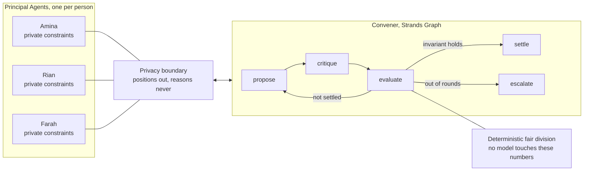
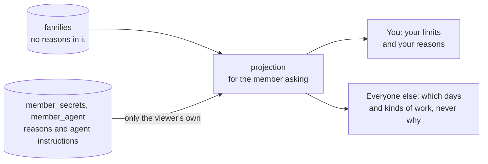
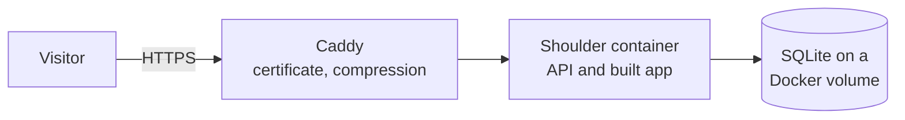

# Shoulder

**Nobody should shoulder it alone.**

Private agents that negotiate the family caregiving load, so one sibling stops carrying all of it.

Built with the [Strands Agents SDK](https://strandsagents.com) for the AWS **Agents for Humans** hackathon.

**Try it:** https://shoulder-100-56-157-153.sslip.io (join with family code `rahman` and member ID
`farah`, or create your own family).

---

## The problem

When a parent starts needing care, the work does not get divided. It lands on one person.

**In 75 percent of families, exactly one adult child becomes the caregiver.** Not by agreement, by
default. Usually whoever lives closest, and usually a daughter. The conversation that would
redistribute the load is the hardest conversation a family ever has, so it never happens.

The scale of what goes unshared is enormous. In the United States alone, 59 million caregivers
provided 49.5 billion hours of unpaid care in 2024, worth **1.01 trillion dollars**, more than all
federal, state and local Medicaid spending combined. Sixty-five percent of that work is done by
women.

Existing caregiving apps are shared to-do lists. The best of them advertise "contribution
visibility": they *show you* the inequity. **None of them redistributes it**, because redistribution
means negotiating between people, and an app cannot negotiate.

There is a randomised clinical trial of a program that teaches family caregivers how to negotiate
with their own siblings. That is how hard this conversation is.

Shoulder does not train anyone to have it. Shoulder has it for them.

## How it works

Each sibling gets their own agent. They tell it their real constraints, including things they would
never say out loud to their family. The agents negotiate a rota that satisfies a fairness invariant,
and surface only what they cannot settle.



### The privacy boundary

Each sibling runs in **their own process, on their own port, serving their own A2A agent card**. The
Convener can only reach them across a network boundary it does not control.

A `Principal` holds everything a person told their own agent. A `Position` is the only thing allowed
to leave it. A private constraint still shapes the negotiation, but its wording and its reason are
dropped:

> Farah's agent knows she is unavailable on Fridays because of chemotherapy infusions.
> The circle only ever learns that Friday is not available to her.

The negotiation routes around her constraint. Nobody learns why. That separation is structural, not
a prompt instruction: `Position` has no field that could carry a reason.

It is also enforced in code. Every principal agent carries a **privacy hook**, a Strands
`HookProvider` that reads every message the model produces before it can leave, and withholds any
that carries a private fact: the reason itself, a reworded fragment of it, or a word that gives the
category away. It does not depend on the model behaving. In our live runs, Sonnet refused to share
Farah's reasons and still called them "private medical information" and "genuine and
health-related". The hook exists for exactly that.

`python -m shoulder.demos.leak` shows it catching a deliberate leak attempt over the real A2A
protocol: what the model wrote, what the hook caught, and what actually crossed the wire.

And it is checked rather than asserted. `python -m shoulder.a2a.demo` captures every message that
crossed the wire to `fixtures/a2a_wire_log.json`, then audits those payloads for any private fact
with the same detector. A privacy claim nobody tests is just a sentence in a README.

### Fairness is computed, never judged

The model negotiates and explains. It does not decide what is fair. All burden, proportionality and
envy calculations are deterministic Python, identical every run, recomputable by hand.

- **Capacity-adjusted proportionality.** Each person's weighted burden divided by their declared
  capacity should sit close to the circle mean. An even split is not fair when one sibling has a
  newborn and another is between jobs.
- **Weighted envy-freeness.** Would anyone rather carry someone else's share than their own, once
  both are scaled by capacity?

Grounded in the fair division literature: *Fair and Efficient Allocation of Indivisible Chores*
(IJCAI 2023), *Distribution of Chores with Information Asymmetry* (arXiv 2305.02986), and
*Repeated Fair Allocation of Indivisible Items* (AAAI 2024).

### The model proposes, the rules decide

Anything the Convener proposes passes through a deterministic legality guard. An assignment that
breaks a stated limit is stripped and re-placed automatically. **A rota that violates someone's
stated constraint never reaches a family**, however good the reasoning behind it looked.

### It refuses to decide

When the stated limits leave no fair split, Shoulder does not pick one. It produces a single
escalation card: what it tried, why it cannot close the gap, the real options with their
consequences, and an explicit statement of what it will not decide.

From an actual run:

> *"I will not choose between these because I do not know what any of you are carrying outside this
> plan, what your mother needs most, or what any sibling can truly afford to change. Those decisions
> belong to the three of you together."*

What it may do alone is also enforced in code, by an **authority envelope hook** on every tool call
the Convener makes. Routine work (a reminder about a task someone already holds) runs unattended.
Anything consequential (booking paid help, dropping a task, changing what someone said they can
carry) never runs: the attempt becomes an escalation card, with the fairness consequence of each
option computed by the engine. Anything the policy does not name is refused. In one live run the
Convener worked out, with the fairness tools, that the split would be almost exactly fair if Farah's
capacity were 0.5 instead of the 0.7 she declared, and reached for it. The hook stopped it: *"I will
not change what Farah said they can carry."*

Everything it does without asking is written to an **agent ledger**, in plain words, with the reason
it was allowed to act alone. `python -m shoulder.demos.envelope` shows the envelope at work.

### It learns, but only what you decided

Care recurs, so Shoulder remembers. Each person's agent keeps what they said, month to month, and
notices what changed. A change to someone's position is noted for the family; a change to a private
reason stays with that person's agent.

Every option on an escalation card carries a typed effect: accept the split, paid help for these
tasks, take these tasks off the plan, or don't do that again. The fairness consequence of each is
computed by the engine, never written by the model. When the family chooses one, code turns it into
a **precedent**, and next month it is applied without asking, cited back to whoever decided it:

> *Arranged paid help for Wednesday overnight stay (Wed 11 Nov); Follow-up nephrology appointment
> (Fri 27 Nov), without asking.* The family decided this on 11 Sep.

In the demo family that one decision takes October's 23 percent spread to November's 4 percent, and
the number of decisions the family is asked to make from two to zero. Nothing is learned that a
person did not decide. `python -m shoulder.demos.next_month` runs both months back to back.

## Running it

Requires Python 3.11 or 3.12 and AWS credentials with Amazon Bedrock access in `us-east-1`.

```bash
python -m venv .venv
.venv/Scripts/activate          # Windows
# source .venv/bin/activate     # macOS and Linux

pip install -e ".[dev]"

python -m shoulder.cli --dry             # deterministic fairness engine, no model calls, no network
python -m shoulder.cli                   # full multi-agent negotiation, in process
python -m shoulder.decide                # answer what it escalated, one card at a time
python -m shoulder.cli --period 2026-11  # the next month, applying what you decided
python -m shoulder.a2a.demo              # the same negotiation across three live A2A servers
python -m shoulder.demos.leak            # the privacy hook catching a leak, no AWS needed
python -m shoulder.demos.leak --live     # the same, with a real model on Bedrock
python -m shoulder.demos.envelope        # the authority envelope at work, no AWS needed
python -m shoulder.demos.next_month      # two months back to back: it learns, no AWS needed
pytest                                   # 144 tests, no AWS needed
```

Runs remember their history in `.shoulder/` (SQLite, never committed). Delete it to start the family
over.

### The family app

The app a family actually uses lives in `app/`, backed by the API in `shoulder/api/`. One process
serves both, and needs no AWS credentials.

```bash
cd app && npm install && npm run build && cd ..
python -m shoulder.api                   # then open http://127.0.0.1:8001
```

For development, run `python -m shoulder.api` and `cd app && npm run dev` side by side, then open
http://localhost:5174. Vite forwards `/api` to the server, so everything stays on one origin.

**Getting in.** Create a family in two steps (who you are caring for, then yourself), and Shoulder
generates two codes: a **family code** to share with your siblings, and a **member ID** that is yours
alone. A sibling joins with just the family code and gets their own member ID. Logging in again takes
both. The Rahmans are already there: family code `rahman`, member ID `farah` (or `amina`, `rian`).
They are restored to their original state every time the server starts.

**Everything you set can be changed later.** Control Panel holds every answer from sign-up (your
name, photo, capacity, distance, the days and kinds of work you cannot do, and the reason behind each
limit) and the details of the person you care for, which change only when the whole family agrees. It
is also where you write standing instructions for your own agent, and read the exact brief it works
from, built by the same function the negotiation uses. Instructions are as private as reasons.

**Nothing about the family is kept in the browser.** Everything lives in SQLite on the server. Logging
in sets an httpOnly session cookie that page scripts cannot read, and the database stores only its
hash. The one thing the browser remembers is your light or dark theme.

**The privacy boundary holds on the server too.** Each response is the family as the person asking may
see it:



Reasons are stored in their own table and never enter the family record, so no route can return one by
accident. Other people's limits even arrive under opaque identifiers, because a limit's own id can give
something away. `tests/test_api.py` logs in as each person and checks every response the API can
produce for anyone else's private words.

**The server decides; the browser shows.** Who does what, how even the split is, who may take each
task, and what every option on a decision card would do are all computed by the Python engine on the
server. A card's preview is made by applying that choice to a copy of the plan, so the number you see
before choosing is the number you get.

### Hosting

The live app runs on one EC2 instance (t3.small, Ubuntu 24.04, us-east-1) with Docker Compose: the app
container built from `Dockerfile`, and Caddy in front of it for HTTPS. The SQLite database is a Docker
volume on the instance's disk, so families survive restarts and redeploys. The Rahmans are put back as
they started every 12 hours (`SHOULDER_RESEED_HOURS`), without logging anyone out.



| File | Purpose |
|---|---|
| `Dockerfile` | Builds `app/` with Node, then runs the API with Python 3.11 as a non-root user. |
| `deploy/docker-compose.yml` | The app and Caddy, with secure cookies, the re-seed schedule, and proxy settings. |
| `deploy/Caddyfile` | HTTPS for `SHOULDER_HOST`, gzip, and a request size cap. |
| `deploy/ec2-user-data.sh` | First boot: swap, Docker, the repository, and `docker compose up`. |
| `deploy/redeploy.sh` | Pull `main` on the server and rebuild. |

To run the production setup anywhere with Docker and a public hostname:

```bash
cd deploy
echo "SHOULDER_HOST=your.domain" > .env
docker compose up -d --build
```

### The storyboard screens

The screens in `web/` are built to be filmed: the negotiation round by round, and what happens under
the hood. They read the JSON in `fixtures/` from real runs, and need no AWS credentials.

```bash
cd web
npm install
npm run dev                             # then open http://localhost:5173
```

| Screen | What it shows |
|---|---|
| Why | The problem and why it persists, with sources |
| Your agent | Private intake: what each person tells their own agent, beside what their family actually sees |
| This month | The negotiation, round by round, with the fairness bar; then the month's rota |
| Needs you | The escalation inbox, one decision at a time; empty when nothing needs you |
| What I did | The agent ledger: every unattended action and why it was allowed |
| Under the hood | The privacy hook's live catch, the authority envelope, the wire, the architecture |

Switch between October and November at the top to see what it learned. `#/month/2026-10/2` opens a
given round directly, and `?theme=dark` forces a theme, which helps when recording.



`--dry` runs the entire fair division engine with no network access, so the maths can be inspected
without credentials. The two demos default to a scripted model that stands in for a misbehaving one,
so the hooks can be shown on any machine.

A full run writes JSON to `fixtures/`: the circle, every negotiation round, the final rota, the
fairness report, the escalation cards and the family's ledger. Later months go to
`fixtures/<period>/`, and `fixtures/family.json` holds the history, every decision and every
precedent.

## Repository layout

| Path | What lives there |
|---|---|
| `shoulder/models/core.py` | Domain types. `Principal` versus `Position` is the privacy boundary. |
| `shoulder/tools/fairness.py` | Deterministic fair division, exposed as Strands tools. |
| `shoulder/agents/principal.py` | The agent that speaks for one person and keeps their secrets. |
| `shoulder/agents/convener.py` | Proposes, revises, repairs, and writes escalation cards. |
| `shoulder/graph/negotiation.py` | The negotiation as a cyclic Strands Graph. |
| `shoulder/a2a/` | Serving each sibling over the A2A protocol, and the wire log the privacy claim is tested against. |
| `shoulder/hooks/privacy.py` | The privacy hook, and the detector the audits share with it. |
| `shoulder/hooks/authority.py` | The authority envelope: what the agent may do alone, and the cards for what it may not. |
| `shoulder/tools/actions.py` | Tools that act in the world, reachable only through the envelope. |
| `shoulder/ledger.py` | The agent ledger. Family entries and each person's private entries, kept apart. |
| `shoulder/precedent.py` | Turning a family's decision into a rule, and applying it next time. |
| `shoulder/session.py` | One period end to end, with memory: the loop the weekly schedule runs. |
| `shoulder/store/` | SQLite: the family's session (rotas, cards, decisions, precedents) and each person's own. |
| `shoulder/api/` | The family app's API: sign-up and login, the per-person privacy projection, and every change, over SQLite. |
| `app/` | The family app in Vite and React. Renders what the API returns and holds no family data. Diagram sources are in `app/src/diagrams/`, drawn ahead of time into `app/public/diagrams/`. |
| `web/` | The storyboard screens: the negotiation and what happens under the hood, reading `fixtures/`. |
| `Dockerfile`, `deploy/` | The production image and the EC2 deployment. |
| `submission/` | The Devpost story, the three Agents for Humans blog posts, and the demo video script. |
| `docs/` | The architecture diagram, exported from the mermaid source in CLAUDE.md. |
| `shoulder/demos/` | Runnable demonstrations of both hooks. |
| `shoulder/seed/demo_circle.py` | The demo family. Entirely fictional. |
| `tests/` | Tests for the engine, both hooks, the ledger, the privacy boundary over A2A and over the family app's API, and the demo scenario. |

## Data

No real family data is used anywhere. The demo circle is fictional and the private constraint in it
is invented to demonstrate the privacy boundary.

## Licence

MIT. See [LICENSE](LICENSE).
