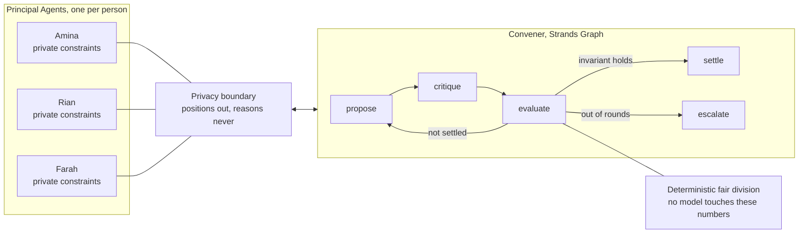

# Shoulder

**Nobody should shoulder it alone.**

Private agents that negotiate the family caregiving load, so one sibling stops carrying all of it.

Built with the [Strands Agents SDK](https://strandsagents.com) for the AWS **Agents for Humans** hackathon.

---

## The problem

When a parent starts needing care, the work does not get divided. It lands on one person.

**In 75 percent of families, exactly one adult child becomes the caregiver.** Not by agreement, by
default. Usually whoever lives closest, and usually a daughter. The conversation that would
redistribute the load is the hardest conversation a family ever has, so it never happens.

The scale of what goes unshared is enormous. In the United States alone, 59 million caregivers
provided 49.5 billion hours of unpaid care in 2024, worth **1.01 trillion dollars**, more than all
federal, state and local Medicaid spending combined. Sixty-five percent of that work is done by
women.

Existing caregiving apps are shared to-do lists. The best of them advertise "contribution
visibility": they *show you* the inequity. **None of them redistributes it**, because redistribution
means negotiating between people, and an app cannot negotiate.

There is a randomised clinical trial of a program that teaches family caregivers how to negotiate
with their own siblings. That is how hard this conversation is.

Shoulder does not train anyone to have it. Shoulder has it for them.

## How it works

Each sibling gets their own agent. They tell it their real constraints, including things they would
never say out loud to their family. The agents negotiate a rota that satisfies a fairness invariant,
and surface only what they cannot settle.



### The privacy boundary

A `Principal` holds everything a person told their own agent. A `Position` is the only thing allowed
to leave it. A private constraint still shapes the negotiation, but its wording and its reason are
dropped:

> Farah's agent knows she is unavailable on Fridays because of chemotherapy infusions.
> The circle only ever learns that Friday is not available to her.

The negotiation routes around her constraint. Nobody learns why. That separation is structural, not
a prompt instruction: `Position` has no field that could carry a reason.

### Fairness is computed, never judged

The model negotiates and explains. It does not decide what is fair. All burden, proportionality and
envy calculations are deterministic Python, identical every run, recomputable by hand.

- **Capacity-adjusted proportionality.** Each person's weighted burden divided by their declared
  capacity should sit close to the circle mean. An even split is not fair when one sibling has a
  newborn and another is between jobs.
- **Weighted envy-freeness.** Would anyone rather carry someone else's share than their own, once
  both are scaled by capacity?

Grounded in the fair division literature: *Fair and Efficient Allocation of Indivisible Chores*
(IJCAI 2023), *Distribution of Chores with Information Asymmetry* (arXiv 2305.02986), and
*Repeated Fair Allocation of Indivisible Items* (AAAI 2024).

### The model proposes, the rules decide

Anything the Convener proposes passes through a deterministic legality guard. An assignment that
breaks a stated limit is stripped and re-placed automatically. **A rota that violates someone's
stated constraint never reaches a family**, however good the reasoning behind it looked.

### It refuses to decide

When the stated limits leave no fair split, Shoulder does not pick one. It produces a single
escalation card: what it tried, why it cannot close the gap, the real options with their
consequences, and an explicit statement of what it will not decide.

From an actual run:

> *"I will not choose between these because I do not know what any of you are carrying outside this
> plan, what your mother needs most, or what any sibling can truly afford to change. Those decisions
> belong to the three of you together."*

## Running it

Requires Python 3.11 or 3.12 and AWS credentials with Amazon Bedrock access in `us-east-1`.

```bash
python -m venv .venv
.venv/Scripts/activate          # Windows
# source .venv/bin/activate     # macOS and Linux

pip install -e ".[dev]"

python -m shoulder.cli --dry    # deterministic fairness engine, no model calls
python -m shoulder.cli          # full multi-agent negotiation
pytest                          # 20 tests, no AWS needed
```

`--dry` runs the entire fair division engine with no network access, so the maths can be inspected
without credentials.

A full run writes JSON to `fixtures/`: the circle, every negotiation round, the final rota, the
fairness report and the escalation cards.

## Repository layout

| Path | What lives there |
|---|---|
| `shoulder/models/core.py` | Domain types. `Principal` versus `Position` is the privacy boundary. |
| `shoulder/tools/fairness.py` | Deterministic fair division, exposed as Strands tools. |
| `shoulder/agents/principal.py` | The agent that speaks for one person and keeps their secrets. |
| `shoulder/agents/convener.py` | Proposes, revises, repairs, and writes escalation cards. |
| `shoulder/graph/negotiation.py` | The negotiation as a cyclic Strands Graph. |
| `shoulder/seed/demo_circle.py` | The demo family. Entirely fictional. |
| `tests/` | Tests for the engine, the privacy boundary and the demo scenario. |

## Data

No real family data is used anywhere. The demo circle is fictional and the private constraint in it
is invented to demonstrate the privacy boundary.

## Licence

MIT. See [LICENSE](LICENSE).
