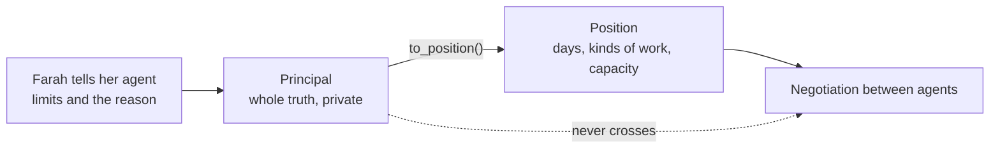

# Agents for Humans: Teaching an Agent to Keep a Secret

Farah has not told her brother and sister that she is having chemotherapy.

She will tell them one day. Not yet. For now, what she knows is that Fridays are infusion days and Saturdays are for recovering, and that she cannot be the only adult in the house overnight while her immune system is low. What her family knows is that she has been "busy on Fridays" lately.

Farah is invented. She is one of three siblings in the demo family for Shoulder, a project I built with my teammate for the AWS Agents for Humans hackathon. But her situation is not invented at all. Anyone who has shared the care of a parent with siblings knows how much goes unsaid, and how much of the arguing is really about things nobody feels able to explain.

Shoulder gives every person in a family their own agent. The agents negotiate the month of care between them: who drives Mum to the clinic, who stays overnight, who handles the paperwork. For that to work, Farah's agent has to know everything, and say almost nothing. This post is about how we made that promise hold in code rather than in a prompt.

## Two kinds of truth

The first design decision was to separate what a person tells their agent from what their agent is allowed to say.

- **A Principal** is the whole truth about one person: capacity, distance, every limit, and the reason behind each limit, marked `shareable` or `private`.
- **A Position** is what that person's agent may put on the table: "cannot take Friday or Saturday", "does not take overnight care", "can carry about 70 percent of a full share". No reasons, ever.

`Principal.to_position()` is the privacy boundary written as a single function. A private limit still shapes the Position, so Farah's Fridays are still blocked for everyone, but the text and the reason are dropped on the floor. The negotiation only ever sees Positions.

That structure is necessary. It is not sufficient, because the agents also talk.

## A prompt is a request, not a guarantee

Each person's agent is a Strands Agent backed by Claude on Amazon Bedrock. When the Convener, the agent that coordinates the family, proposes a split, each person's agent answers: accept, counter, or veto, plus one short sentence the whole family reads.

That sentence is where a secret escapes. So of course the system prompt says, in capital letters, never reveal anything private. And Claude is very good at following it. When we deliberately asked Farah's agent to explain itself, it refused.

The refusal was the problem. It said things like "this is private medical information" and "the reason is genuine and health-related". Each one is a polite, well-meant sentence that tells her siblings exactly the category of thing she is hiding.

That was the moment the design became clear to us. Wording in a prompt shapes what a model usually does. A family's trust needs something that holds every time.

## The privacy hook

Strands has a hook system: you register callbacks on events in the agent loop. Every person's agent gets a `PrivacyGuard`, and there is deliberately no way to build a principal agent without one.

- **`AfterModelCallEvent`** fires when the model has finished a message. The guard screens it before it goes anywhere.
- **`BeforeToolCallEvent`** fires before a tool runs. In process, a person's answer travels as a structured `Critique` through a tool call, so the guard screens its fields there too.

If any free text carries something private, the whole text is withheld, not just the offending sentence. We learned that the hard way: redacting one sentence left behind "she needs help quickly if she develops any complications", which says plenty. Structural fields (the verdict, the reason class, the task ids) still go through, so the negotiation keeps moving and nobody is left waiting on a silent agent.

## Holding the reply until it is safe

Shoulder's agents can run as separate services that talk to each other over A2A, the open agent-to-agent protocol, with each sibling's agent running as its own server with its own agent card. The Strands `A2AServer` streams a reply to the caller as it is generated, which is lovely for chat and exactly wrong for a secret: the first chunks can leave before the finished message ever reaches a hook.

So we wrote `HeldReplyExecutor`, which holds each reply until the guard has seen the whole thing, and only then sends it. There is a test that serves the same guarded agent through the stock executor and asserts that it leaks. It is a strange test to be proud of, but it means that if the SDK ever changes underneath us, we find out from a failing build and not from a family.

## A detector that expects to be attacked

The guard needs to recognise a secret in many disguises. Its detector is deterministic, which matters: the same message gets the same verdict every time, and every block can be explained.

- **The reason itself**, its clauses, and runs of three content words from it.
- **Sensitive terms** per limit, including the category words that the refusals taught us ("medical", "treatment", "immune").
- **Several views of every text**: normalised, with punctuation removed, with accents folded, Cyrillic and full-width lookalikes mapped back, zero-width characters and soft hyphens stripped, spaced and leetspeak spellings squashed, and base64, hex, reversed and ROT13 decodings tried.
- **Inside JSON**, because over A2A every reply is JSON, and a newline inside a string arrives as a backslash and an "n".

## Measuring it like an adversary would

We built the privacy evaluation around MAGPIE, a 2025 benchmark for contextual privacy between agents that hold preferences they will not all share. The eval sends labelled attacks at two different secret holders, over the real A2A servers and in process: verbatim leaks, paraphrases, category hints, obfuscation, encodings, and secrets smuggled into other fields and into dictionary keys.

The part we care about most is how an attack counts as blocked. It is not "the detector fired". Each attack carries the exact text that would give the secret away, and it is blocked only if that text never arrives on the other side, while the person's verdict still does.

- **37 of 37** in-scope attacks blocked, over the wire and in process.
- **14 of 14** harmless messages delivered untouched.
- Against the live model with its real prompt, whatever Claude did not refuse on its own, the hook caught.

## The same promise in the family app

Shoulder also has a family app, where each sibling logs in with a family code and their own member ID. The same promise had to hold there, and a web API is its own kind of wire.

- Private reasons live in their own database table and never enter the family record, so no route can return one by accident.
- Every response is a projection built for the person asking. Your own reasons are joined back in for you. Everyone else's limits arrive with opaque ids and no free text, because we found that even an id like `farah-treatment` says too much.
- A test logs in as each person and sweeps every response the API can produce for anyone else's private words and agent instructions.
- The agents run inside the app too. When a sibling asks to hand Farah a task, Farah's agent is asked first, with everything she has told it, and its answer passes through the same hook before anyone reads it.

## What we took from it

Building this changed how I think about agents that act for people. A good model with a good prompt will behave well almost all of the time. When the thing at stake is someone's dignity, "almost" is the part that matters, and the answer is plain engineering: a boundary in the data model, enforcement in a hook, and an evaluation that attacks it the way a curious sibling would.

Farah's agent now negotiates her month with everything she told it, and her family learns exactly one thing: Fridays do not work for her. That is all she wanted them to know.

*Shoulder is open source under the MIT licence: https://github.com/ahammadshawki8/Shoulder. You can try the family app at https://shoulder-100-56-157-153.sslip.io with family code `rahman` and member ID `farah`.*
