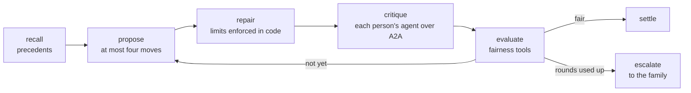

# Agents for Humans: Fair Division as a Deterministic Tool

Ask three siblings whether the care of their mother is shared fairly and you will get three answers, all sincere.

Amina lives four kilometres away and drops in most evenings. Rian lives three hundred kilometres away, works Monday to Thursday, and quietly pays for things. Farah has limits she does not explain. Each of them is doing something. None of them can see the whole picture, and the one conversation that would settle it is the one nobody wants to start.

When we built Shoulder, a set of agents that negotiate a family's care load, the first rule we wrote down was this: **the language model never computes fairness.** It can propose, argue, and explain. The numbers come from code. This post is about why, and how that code works.

## Why fairness cannot be a vibe

Large language models are wonderful negotiators and unreliable accountants. In early experiments, when we asked the model to re-emit a whole month's allocation each round, the split drifted further from fair with every round, and the model described each worse version with total confidence.

A family needs the opposite: the same inputs give the same answer, every time, and anyone can check it by hand. So every fairness figure in Shoulder is produced by plain Python functions exposed to the agents as Strands `@tool`s. The agents call them. They cannot overrule them.

## What an hour of care weighs

The first question is how heavy a task is, and the honest answer is: it depends on the task and on the person.

```python
def task_load(task, distance_km):
    weight = EFFORT_WEIGHTS.get(task.type, 1.0)      # a night awake is not an hour of paperwork
    minutes = task.duration_min * weight
    if needs_travel(task):                           # paperwork can be done from anywhere
        minutes += min(2 * distance_km * 1.2, 180)   # round trip, capped per task
    return minutes / 60.0
```

- **Effort weights** turn clock time into felt load. Overnight care counts double; paperwork counts less than an hour.
- **Travel** is added only when a body has to be in the room, and it is capped, because someone who lives far away makes one long trip and does several things while there.
- **Personal aversions** scale a task for one person. The same drive costs different people different amounts, and that asymmetry is exactly what makes a negotiated split better than an even one.

## Fair is not equal

An equal split sounds fair until one sibling has a newborn and another is between jobs. Shoulder uses two ideas from the fair division literature, adjusted for capacity.

- **Capacity-adjusted proportionality.** Each person's weighted load divided by the capacity they declared should sit within 15 percent of the family's mean. Farah said she can carry 70 percent of a full share, so her fair share is smaller, and nobody needs to know why.
- **Weighted envy-freeness.** Person A envies person B when A's own bundle, scaled by A's capacity, costs A more than B's bundle would, scaled by B's capacity. Disutility is personal, so envy is computed from each person's own point of view.

These come straight from recent work on allocating chores rather than goods: fair and efficient allocation of indivisible chores (IJCAI 2023), the distribution of chores when preferences are private (information asymmetry, arXiv 2305.02986), and repeated fair allocation over time (AAAI 2024). Caregiving is all three at once: indivisible tasks, private limits, and a month that comes round again.

## The model proposes, the rules decide

The negotiation is a Strands Graph with bounded rounds.



Several small decisions made this dependable.

- **Moves, not whole allocations.** The Convener suggests at most four named moves per round, such as "Pharmacy run (Fri) from Amina to Rian". Small steps stopped the drift.
- **Eligibility is computed first.** Early on, the model kept offering Farah Friday work. Now it receives the list of legal moves and chooses among them. Whether someone can take a task is a rule, not a judgement.
- **A legality guard after every proposal.** `repair_allocation` strips any assignment that breaks a stated limit and places the task again. A rota that breaks someone's limit never reaches a family, and every reversal is written to the ledger.
- **Hill climbing.** A round may try a worse split. The working rota only ever gets fairer. Candidate splits are ranked by limits broken, then care left uncovered, then spread.

## Finding the remedy the model would miss

Sometimes no rearrangement within the family is fair, because the limits leave too much on one person. Then the engine searches for the smallest outside help that fixes it: every one or two task combination that paid help could cover, measured with the same fairness functions.

For the demo family, it finds that paid help for one overnight stay and one follow-up appointment takes the spread from 23 percent to about 12 percent. The Convener is handed that as a fact. It never guesses at it, and every figure on the decision card is recomputed by the engine.

## Testing the maths like we meant it

The fairness evaluation generates families of two to five people with random limits and runs the whole graph against them, with a scripted Convener that is deliberately hostile: it proposes illegal moves, reaches for tools it should not use, and writes cards full of invented numbers. Thirteen properties are checked every run, including:

- the rota never breaks a stated limit,
- the report shown to the family is exactly what the engine recomputes,
- a settled month is proportional, complete, and unobjected,
- no action outside the agent's authority ran,
- the engine is deterministic, independent of task order and of units, and blind to whether a limit is private.

That last one is quiet but important. Farah's limits bind exactly as hard as anyone's, whether or not she explains them.

## The part the family sees

All of that machinery ends in one calm sentence and one bar. In the family app, the fairness bar shows each person's share of the load in their colour, with a headline written by the engine: "Amina is carrying 46 percent more than Farah," or, once it settles, "The care is shared fairly." The same Python engine runs on the server for the app, so a decision card's preview is made by applying that option to a copy of the plan. The number you see before you choose is the number you get.

Fairness in a family is not a feeling anyone should have to argue for. It is something you can measure, gently, and then talk about with the numbers already agreed.

*Shoulder is open source under the MIT licence: https://github.com/ahammadshawki8/Shoulder. Try the family app at https://shoulder-100-56-157-153.sslip.io with family code `rahman` and member ID `farah`.*
