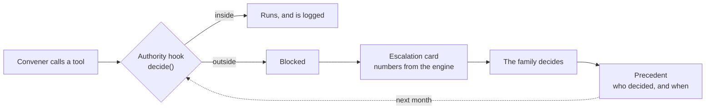

# Agents for Humans: Building an Agent That Refuses to Decide

There is a clinical trial, published in the Journal of the American Geriatrics Society, of a program called NegotiAge. It uses AI role play to teach family caregivers how to negotiate with their own brothers and sisters, complete with simulated relatives who get emotional and unreasonable.

I read that and sat with it for a while. People need training, in a trial, to talk to their siblings about their mother. That is how hard the conversation is.

Shoulder is our answer to that paper. We did not build the training. We built the negotiation: each family member gets a private agent, and the agents work out the month of care between them. But the moment you build agents that negotiate for people, a harder question arrives. What are they allowed to decide?

Our answer is: almost nothing that matters. This post is about building an agent whose most important feature is knowing when to stop.

## The line we drew

We wrote the rule before we wrote the code. **The agent never makes the human decision.** It proposes, it does the safe routine work, and it hands everything consequential back to the family, with the facts laid out.

That sounds like a principle. We needed it to be a mechanism.

## The authority envelope

In Strands, every tool call passes through `BeforeToolCallEvent`. The Convener, the agent that coordinates the family, carries an `AuthorityGuard` hook on that event, and the hook asks a pure function one question: is this inside the envelope?

- **Measuring is always allowed.** Computing burdens and checking fairness changes nothing.
- **Reminders are allowed only about work someone already holds.** Handing someone new work by message is not the agent's to do.
- **Spending the family's money, dropping care, or changing what someone said they can carry are outside.** Always.
- **Anything unnamed is outside.** The envelope fails closed. A new tool does not quietly gain authority by existing.

We offer the agent the refused tools on purpose. The envelope is a policy about authority, not about which buttons exist, and we want to see the agent reach for one and be stopped.

A refused call never runs. The model is told, in plain words, that it was not done and has been raised with the family. The hook turns the attempt into an escalation card, and the whole thing is written to the family's ledger.

## The moment it said no

In one live run, the Convener used the fairness tools and noticed something: if Farah's capacity were 50 percent instead of 70, the split would be almost exactly fair. So it called `change_capacity`.

The envelope refused, with the sentence we wrote for exactly this case: "I will not change what Farah said they can carry."

That is my favourite line in the project. The agent had found a mathematically neat solution, and it was a solution that quietly asked the one person hiding chemotherapy to do more. Only Farah gets to revisit Farah's limits, privately. We later added the same rule to how cards are written: no option may ask a named person to give up a limit.

## A card, not a verdict

When the agents cannot close the gap inside everyone's limits, the family gets one card at a time. The card is a typed contract between the agent and the interface.

- **What I tried**, in plain language.
- **The tension**, as the engine measured it: "Amina is carrying 46 percent more than Farah."
- **Options**, each with its consequence, and each option's effect on fairness computed by the engine rather than written by the model.
- **What I will not decide**, stated outright.

Early live cards opened with sentences like "70.48 adjusted share against a mean of 62.67". Accurate, and useless at eleven at night. The headline now comes from the engine in words, and the model is asked to write for a family, not an auditor. In the family app, choosing an option shows its preview first, made by applying that choice to a copy of the plan, so the family sees exactly what will change.

## Asked once, remembered

A decision a family makes should not have to be made again next month. So a resolved card becomes a precedent.

- **The rule is extracted in code** from the chosen option's typed effect: paid help for these tasks, remove these tasks, decline this action, or accept this split.
- **It carries provenance**, always shown: "Amina decided this on 11 Sep."
- **The envelope widens only by precedent.** Paid help for tasks the family already chose to cover becomes routine. An action the family declined is neither taken nor asked about again.
- **One answer closes the same question everywhere.** Choosing paid help on the fairness card also resolves the separate card the envelope raised about booking it.
- **It can be retired.** Retiring a precedent brings the question back.

For the demo family, October asks two questions. The family chooses paid help once. November asks none, and says why.

## Proving the boundary

An agent that refuses to decide is only useful if it refuses the right things. We scored the envelope like a classifier over 25 hand-labelled scenarios, 16 where the family must be asked and 9 where the agent should act or hold, through the hook and through whole negotiations.

- **Precision 1.0 and recall 1.0**, with zero missed escalations.
- Across four simulated months, a family that answers with a reusable decision is asked **2, then 0, 0, 0** times.
- A family that decides nothing is asked just as often every month. Only their own decisions make the agent quieter.

## Why this is the product

It would have been easy to build an assistant that simply assigns the tasks. It would also have been wrong. Nobody wants software deciding who looks after their mother, and nobody should.

What families need is something that does the patient, fiddly work of fitting everyone's limits together, and then says honestly: this part is yours, here are the real options, and here is what each one would change. Every week it interrupts a little less, because it remembers what you told it.

The agent never decides. That is not a limitation we are apologising for. It is the whole point.

*Shoulder is open source under the MIT licence: https://github.com/ahammadshawki8/Shoulder. Try the family app at https://shoulder-100-56-157-153.sslip.io with family code `rahman` and member ID `farah`.*
