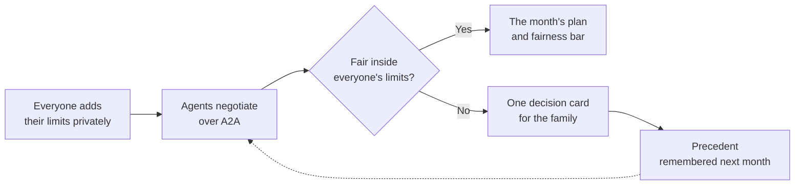
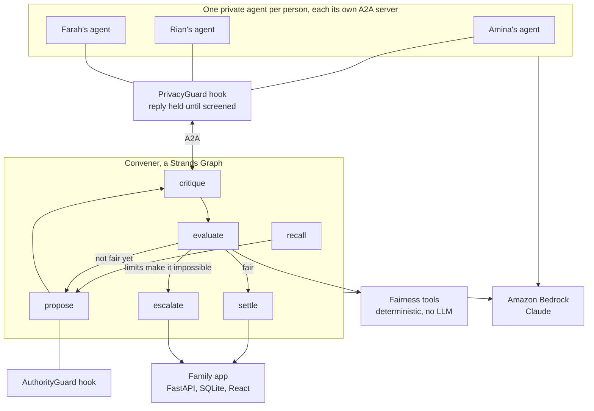

# Shoulder

**Nobody should shoulder it alone.**

Private agents that negotiate the family caregiving load, so one sibling stops carrying all of it.

- **Live app:** https://shoulder-100-56-157-153.sslip.io (join with family code `rahman` and member ID `farah`, or create your own family)
- **Code:** https://github.com/ahammadshawki8/Shoulder (MIT)

---

## It is 11:40 on a Tuesday night

Amina is in a hospital car park for the third time this week. Her mother's blood sugar dropped again. She types into the family group chat: "At the hospital with Mum. Again."

Two blue ticks. No reply.

Her brother Rian lives three hundred kilometres away and works until Thursday. He feels guilty, so he sends money and says nothing. Her sister Farah lives twenty minutes away and has not been round on a Friday in months. Amina assumes Farah does not care. The truth is that Farah is in chemotherapy, every Friday, and has not found the words to tell anyone.

Nobody in this family is a bad person. Nobody decided that Amina would do everything. It just happened, the way it happens in most families, because the conversation that would share it out is the hardest conversation a family ever has.

We built Shoulder for Amina, for Rian, and especially for Farah.

---

## Inspiration

- **One child ends up doing it all.** In 75 percent of families, when a parent needs care, only one adult child becomes the caregiver. Not by agreement, by default. (Raab, Engelhardt and Leopold, *Journal of Marriage and Family*, 2014, drawing on 2,452 parent and child relationships in the US Health and Retirement Study.)
- **The scale is staggering.** 59 million Americans gave 49.5 billion hours of unpaid care in 2024, worth 1.01 trillion dollars, more than all Medicaid spending combined. 65 percent of it is done by women. (AARP, *Valuing the Invaluable*, 2026 update; National Partnership for Women and Families.)
- **It is a global story.** Unequal division of care among siblings and the burden it creates are documented across cultures, from rapidly ageing East Asian populations to a 20-country study of how societies see caregivers. Shoulder hardcodes no country, benefit scheme, or legal system: only tasks, capacities, and fairness.
- **The conversation is the real barrier.** NegotiAge, a trial published in the *Journal of the American Geriatrics Society*, uses AI role play to teach caregivers how to negotiate with their own siblings. When people need a clinical program to talk to their brother about their mother, the problem is not a missing to-do list.
- **Existing apps only show the problem.** Care apps are shared calendars. The best of them offer "contribution visibility": they show you that one person does more. None of them redistributes it, because redistribution means negotiating between people who each have limits they may not want to explain.
- **So we asked a different question.** What if every person had an agent that knew their whole truth, negotiated for them, kept their secrets, and handed back only the decisions that are genuinely human?

---

## What it does

Shoulder is a calm product with a straight line through it: everyone adds themselves, the agents negotiate, the family is asked only when it has to be, and the answer is remembered.

- **Private intake.** Each person says, alone, how much of the care they can carry, which days and kinds of work they cannot do, and why, if there is a reason they would rather not say out loud. The screen marks it plainly: never shown to your family.
- **A private agent for every person.** Each agent knows its person's whole truth but speaks only in positions: "cannot take Fridays", never "has chemotherapy on Fridays".
- **Autonomous negotiation.** A Convener agent proposes a split, each person's agent critiques it, and the rounds repeat until the month is fair or the limits make that impossible. In the family app this happens by itself: add a task for "whoever has room", or let someone join or change their limits, and about a minute and a half later the agents renegotiate the whole plan while the family watches each step appear.
- **Nothing lands on you without your agent's say.** Handing a task to a sibling asks that sibling's own agent first, with everything only they have told it. The task moves only if it agrees.
- **Fairness that is measured, not guessed.** Every task is weighted by effort and travel, and every share is measured against what that person said they can carry. The fairness bar shows the result in each person's colour.
- **One decision at a time.** When the agents cannot close the gap, the family gets a single card: what was tried, the tension in plain words, real options with their exact effect on fairness, and what the agent will not decide.
- **It learns what you decided.** A resolved card becomes a precedent with its provenance ("Amina decided this on 11 Sep"), applied automatically next month. Our demo family is asked two questions in October and none in November.
- **Everything is auditable.** An Agent activity view shows every step taken without asking, grouped into negotiation rounds, with a decision graph per round: moves proposed, the limit check, each agent's answer, and the engine's measurement.
- **A real family app.** Create a family in two steps and share a family code; each sibling joins with the code and gets their own member ID. Tasks, calendar, handovers, notes, a family inbox, agreed rules, and full settings, including private instructions to your own agent. Light and dark, desktop and phone.

---

## How we built it

- **Strands Agents SDK at the core.** Every agent is a Strands Agent on Amazon Bedrock, with Claude Sonnet 4.5 doing the negotiation, critique and explanation.
- **A2A for real privacy isolation.** Each sibling's agent runs as its own `A2AServer` with its own agent card and `context_id`. Private state lives in a process the Convener cannot read, so the privacy boundary is architectural, not a promise.
- **A Strands Graph for the negotiation.** `recall`, `propose`, `critique`, `evaluate`, then `revise`, `settle` or `escalate`, with bounded rounds and conditional exits. A deterministic `recall` node applies the family's precedents before anyone negotiates.
- **Deterministic fairness tools.** `compute_burden`, `check_proportionality`, `check_envy_freeness` and `fairness_report` are plain Python exposed as Strands `@tool`s. They implement capacity-adjusted proportionality and weighted envy-freeness from the fair division literature on indivisible chores (IJCAI 2023), chores under information asymmetry (arXiv 2305.02986), and repeated allocation over time (AAAI 2024). No language model ever computes a fairness number.
- **Two enforcement hooks.**
  - `PrivacyGuard` on `AfterModelCallEvent` and `BeforeToolCallEvent` screens every outbound message against the person's private reasons, with a deterministic detector that sees through paraphrase fragments, lookalike characters, encodings and JSON escapes. A custom `HeldReplyExecutor` holds each A2A reply until it has been screened.
  - `AuthorityGuard` on `BeforeToolCallEvent` enforces what the agent may do alone. Measuring is free, reminders only concern work someone already holds, and spending money, dropping care, or changing someone's capacity always become a card. Unknown tools fail closed.
- **Structured output as a contract.** Escalation cards, critiques and option effects are typed models, so the interface renders exactly what the agents produced and every consequence is recomputed by the engine.
- **Memory that belongs to the right person.** Each person's profile and private ledger live in their own store; the family's rotas, decisions and precedents live in a shared one.
- **Agents inside the app.** A background agent service runs the same Strands graph on a family's live plan with Claude on Amazon Bedrock. Each person's agent is built from their private reasons and their own instructions, every step streams into the family's Agent activity as it happens, and a budget with cooldowns keeps model spend predictable.
- **The family app.** FastAPI and SQLite on the server, React and Vite in the browser. Every response is a per-viewer projection: your reasons come back to you, everyone else's limits arrive with opaque ids and no text. Sessions are httpOnly cookies with hashed tokens, and writes are serialised so two siblings can change the plan at once.
- **Hosted on AWS.** One EC2 instance running Docker Compose, with Caddy providing HTTPS, the SQLite database on a persistent volume, and an IAM role scoped to invoking Claude Sonnet 4.5 on Amazon Bedrock.

---

## Challenges we ran into

- **Streaming replies.** A2A streams text as it is generated, so a hook that screens the finished message would have been too late for the first chunks. We built `HeldReplyExecutor` to hold each reply until it has been screened, and pinned it with a test that proves the stock path would leak.
- **Polite refusals that still told the story.** Asked to explain herself, Farah's agent refused, but its refusals named the category ("private medical information"). That convinced us enforcement belongs in code, and category words became part of each limit's sensitive terms.
- **Keeping the maths out of the model.** Asking the model to re-emit a full allocation every round made the split drift. Limiting it to four named moves, precomputing which moves are legal, repairing every proposal in code, and hill climbing on fairness made negotiation converge.
- **Cards written for families, not auditors.** Early cards opened with "70.48 adjusted share against a mean of 62.67". Headlines now come from the engine in plain words, and no option may ask a named person to give up a limit.
- **Privacy in the web app too.** Even a constraint id like `farah-treatment` said too much, so other people's limits now travel under opaque ids, and a test sweeps every API response for anyone else's private words.

---

## Accomplishments that we're proud of

- **A privacy boundary that survives attack.** A MAGPIE-framed adversarial evaluation sends labelled attacks over real A2A servers: paraphrases, category hints, base64, ROT13, Cyrillic lookalikes, zero-width characters, smuggling into other fields. **37 of 37 in-scope attacks blocked, with the person's verdict still delivered every time, and 14 of 14 harmless messages untouched.**
- **An agent that knows its place, measurably.** Scored as a classifier over 25 hand-labelled scenarios, the authority boundary reaches **precision 1.0 and recall 1.0, with zero missed escalations.**
- **Fairness you can trust.** Thirteen properties are checked across generated families with a deliberately hostile Convener: no stated limit is ever broken, every figure shown is recomputed, and the engine is deterministic, order and scale invariant, and blind to whether a limit is private.
- **It genuinely learns.** Over four simulated months, a family that answers with a reusable decision is asked **2, 0, 0, 0** times, and every automatic action cites who decided it and when.
- **One decision, real impact.** For the demo family, choosing paid help for two tasks takes the spread from **23 percent to 12 percent** and settles the month.
- **A complete, hosted product.** A family app anyone can use today, where real agents on Amazon Bedrock negotiate a family's plan live, with accounts, a server-side privacy projection, and **155 automated tests**, plus 31 gated checks across four evaluation suites.

---

## What we learned

- **Hooks are where trust lives.** A prompt shapes what a model usually does. A Strands hook decides what always happens.
- **Let the model negotiate and the code keep score.** LLMs are excellent at proposing and explaining, and deterministic tools are excellent at being right. Shoulder is strongest where each does only its own job.
- **A2A is more than transport.** Separate servers with separate contexts turn "the coordinator cannot read your secrets" from a policy into a fact about the system.
- **Evaluations must be adversarial and honest about ground truth.** An attack counts as blocked only if the secret never arrives and the verdict still does. A guard that blocks everything would pass a lazy test.
- **Design for the hardest moment.** The interface is quiet on purpose: one decision per screen, never blaming anyone, and an empty inbox treated as success.

---

## What's next for Shoulder

- **Amazon Bedrock AgentCore Runtime.** Move the agent service onto AgentCore Runtime with a weekly schedule, so every family's month is renegotiated even when nothing has changed.
- **AgentCore Memory and Identity.** Each sibling as a distinct authenticated principal, with per-person memory kept apart from the family's.
- **Gentle notifications.** A message only when a decision is genuinely needed, through AgentCore Gateway.
- **Wider care circles.** Partners, grandchildren, neighbours and close friends, with the same fairness and privacy guarantees.
- **Stronger private understanding.** A second, model-based privacy reviewer layered on top of the deterministic detector for euphemism and other languages, never replacing it.
- **Piloting with real families** through caregiver support organisations.

---

## Why Shoulder deserves first prize

- **It solves a human problem nobody else is solving.** Care apps show inequity. Shoulder is the first to redistribute it, because it is the first to negotiate it.
- **It is not another monitor, filter and alert agent.** Most agent projects watch something and escalate. Shoulder runs an N-way, longitudinal negotiation between agents that hold private preferences, governed by a fairness invariant. That topology is its originality.
- **It uses Strands the way Strands was meant to be used.** A2A for genuine isolation, a Graph for bounded negotiation, `@tool`s for verifiable maths, hooks for enforcement, structured output as a contract, and memory for precedents. Every feature is there because the problem demands it.
- **It is responsible by construction.** The agent never makes the human decision, fairness never goes through an LLM, and a private reason never leaves its owner. All three are enforced in code and proven by evaluations, not stated in a slide.
- **It is research-backed.** From the 75 percent finding to NegotiAge, MAGPIE, and modern fair division theory, every design choice traces back to evidence.
- **It is real.** A live, hosted family app where the agents negotiate on Amazon Bedrock as you watch, an open-source codebase, 155 tests, and four evaluation suites. Judges can log in as Farah right now, press "Negotiate now", and watch her secret stay hers.

Amina should not be alone in that car park. With Shoulder, she will not be.

**Nobody should shoulder it alone.**
